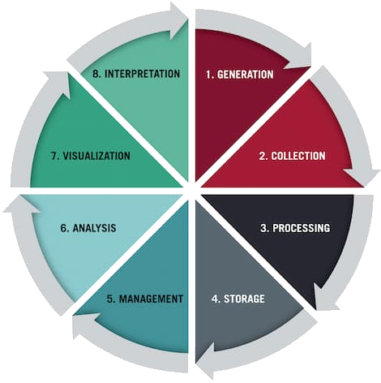
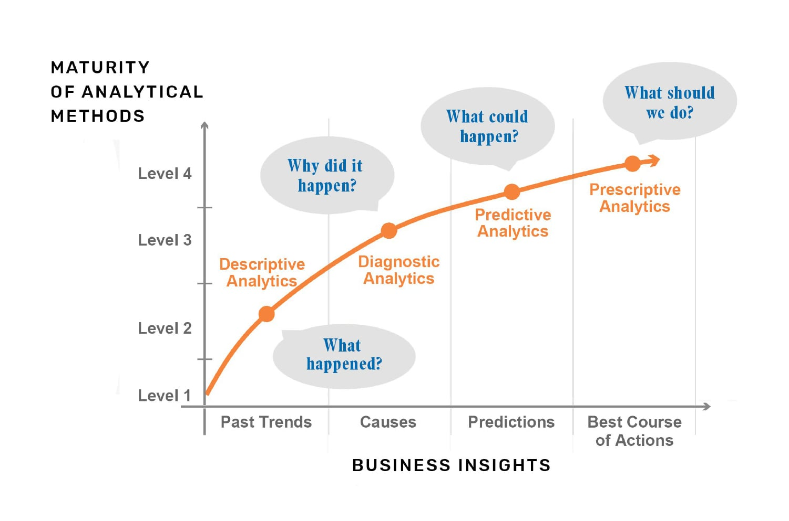

<!-- _class: centered -->
# Data Analysis 2.0  
---
# Содержание:
1) Обзор курса
2) Data analysis
3) Техническая составляющая
4) Пример реальных кейсов
---
# Как работает курс?

День недели | Время | 
-----|------|
Среда | 19:30 - 21:30 |
Суббота | 12:00 - 14:00 | 
- **Теория - практика**
- **Формат работы**
- **Итоговый проект**
---
# Что такое Data Analysis?
- **Data** данные, структурированные **/** неструктурированные
  **-** Cтатистика, продажи, информация о клиентах
  **-** Документы, электронные письма, изображения
- **Аналитика данных** = превращение данных в **insights**
- **Insights** - полезные знания, которые помогают принимать решения
- **Data Life Cycle** - цикл обработки данных с генерации до интерпретации
---
<!-- _class: centered -->
**Data Life Cycle**

---
# Data generation и data collection
- **Генерация данных:** взаимодействия клиента с приложением, работа датчиков, заполнение опроса
- **3 типа данных**
  **-** **Первичные данные**, которые ваша организация собирает непосредственно от пользователей
  **-** **Данные второй стороны** - данные, которыми делится другая организация о своих клиентах
  **-** **Данные третьих сторон** - данные, которые не имеют отношения к вашей компании или пользователям
---
# Каким образом собирают данные?
- **Формы:** веб-формы, формы для клиентов, HR-заявки
- **Опросы:** полезный способ сбора информации
- **Интервью:** качественные данные от пользователей
- **Прямое наблюдение:**  наблюдение за тем, как клиент взаимодействует с вашим продуктом
- **Мониторинг:** с использованием сторонних продуктов
---
# Processing
 - **Обработка данных** при которой набор данных очищается и преобразуется из исходного вида в более доступный и пригодный для использования
 - **Сжатие данных** при котором данные преобразуются в формат, который можно более эффективно хранить
 - **Шифрование данных**, при котором данные переводятся в другую форму кода для защиты от угроз конфиденциальности
 ---
 # Storage и management
**-** **Сохранение данных:** данные после обработки сохраняются в базах/наборах и размещаются в облаке, на серверах или носителях
**-** **Управление данными** Непрерывный процесс организации, хранения и извлечения данных на протяжении всего проекта. Включает шифрование, хранение, а также ведение журналов доступа и изменений, отражающих, взаимодействия с данными

---
# Последние этапы
- **Анализ данных** получение insights с помощью статистического моделирования, алгоритмов, ИИ, data mining и машинного обучения
- **Визуализация данных** -  представление информации в графической форме с использованием специальных инструментов
- **Интерпретация** - осмысление результатов анализа и визуализации с учетом экспертизы и контекста
---

<!-- _class: centered -->
# Типы аналитики 

---
<!-- _class: centered -->
# Инструменты аналитика

| Этап | Инструменты / технологии |
|------|---------------------------|
| Работа с данными | **Python**, **pandas**, **NumPy** |
| Визуализация | **Matplotlib**, **Seaborn**, **PowerBI**, **Tableau** |
| Машинное обучение | **scikit-learn** |
| Работа с БД | **SQL**, **PostgreSQL / SQLite** |
| Веб-скрейпинг | **Selenium** |
| Приложения | **Streamlit** |
| Контроль версий | **Git**, **GitHub** |
| Среда разработки | **Google Colab**, **VS Code**, **Jupyter Notebook** |

---
# Востребованность профессии
- Рынок аналитики больших данных в настоящее время оценивается в 348,21 млрд $
- Прогнозируется, что рынок больших данных будет расти со скоростью 13% в год
- ~181 зеттабайт данных ожидается к концу 2025 года 
*https://www.demandsage.com/big-data-statistics/*
*https://www.statista.com/statistics/871513/worldwide-data-created/*

---

| Год  | Количество данных | Процентное изменение  с предыдущим годом |
|-------|----------------|------------------------------------------|
| 2025* | 181 zettabytes | 23.13%                                   |
| 2024* | 147 zettabytes | 22.5%                                    |
| 2023  | 120 zettabytes | 23.71%                                   |
| 2022  | 97 zettabytes  | 22.78%                                   |
| 2021  | 79 zettabytes  | 23.05%                                   |
| 2020  | 64.2 zettabytes| 56.59%                                   |
| 2019  | 41 zettabytes  | 24.24%                                   |
| 2018  | 33 zettabytes  | 26.92%                                   |
| 2017  | 26 zettabytes  | 44.44%                                   |
| 2016  | 18 zettabytes  | 16.13%                                   |
| 2015  | 15.5 zettabytes| 24%                                      |

---
# Обслуживание оборудования

General Electric анализирует данные с датчиков турбин и двигателей, чтобы понять **когда произойдёт поломка**:

- Анализ вибраций, температуры, давления  
**-** −30% незапланированных ремонтов  
**-** +15% эффективности  
**-** $50 млн экономии в год

---
# PathAI: Ошибки в диагнозах

PathAI анализирует миллионы медицинских изображений,  
чтобы понять **почему** врачи иногда ошибаются в диагнозе:

- Сравнение паттернов в снимках -> выявление причин неточностей  
**-** +25% точности диагностики  
**-** −20% ложных диагнозов  
**-** −50% времени анализа

---
# Amazon: Аналитика продаж 
Amazon анализирует миллионы покупок и просмотров товаров, чтобы понять **поведение покупателей** и **построить отчёты**:
- Трекинг заказов и предпочтений -> понимание трендов спроса  
**-** +68% CTR   
**-** +29% среднего чека  

---
# Сингапур: Умный город

Сингапур анализирует данные трафика, освещения и энергии, чтобы **принимать решения автоматически**:

**-** −25% пробок  
**-** −15% энергопотребления  
**-** 90% запросов граждан решаются < 48 часов  

---
# Домашнее задание 
**Создать аккаунт:**
- [GitHub](https://github.com/signup) — для проектов и репозитория курса
- [Kaggle](https://www.kaggle.com/) — для работы с датасетами

**Пройти вводный курс:**
  -  [Kaggle: *Python Course*](https://www.kaggle.com/learn/python)
  - или [W3Schools: *Python Tutorial*](https://www.w3schools.com/python/)