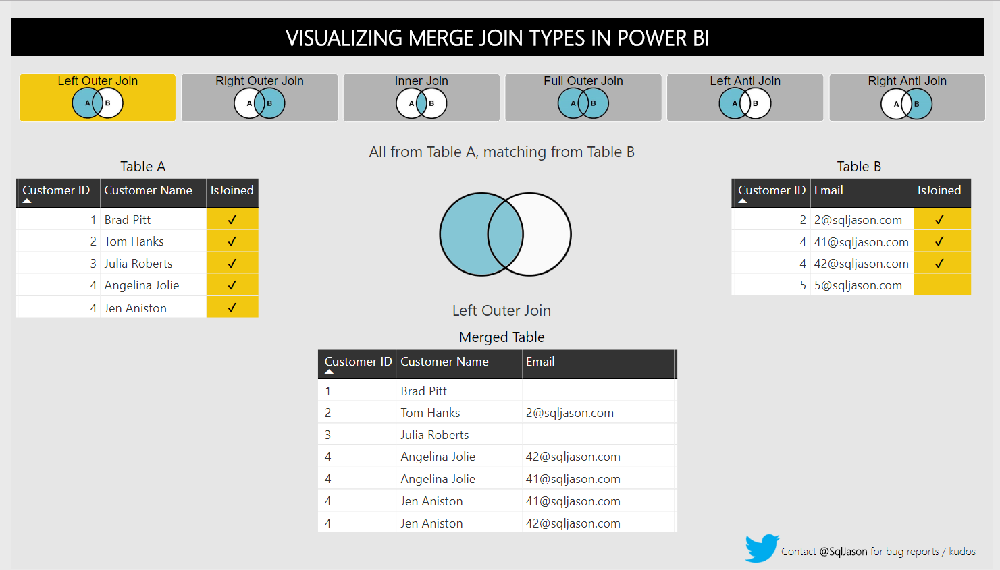

<!-- _class: centered -->
# Power BI: работа с данными

---
# Структура работы

```
1. Power Query, подготовка данных
2. Model, связи между таблицами  
3. DAX, вычисления
```
---
# Основные операции

| Операция | Назначение |
|----------|------------|
| Change Type | Типы данных (Text, Number, Date) |
| Add Column | Новые колонки из существующих |
| Split Column | Разбить одну колонку на несколько |
| Merge Queries | JOIN таблиц по ключу |
| Group By | Агрегация |
| Unpivot | Широкая таблица -> длинная |

---
**Широкий формат (Wide):**

| Product | Jan | Feb | Mar |
|--------|-----|-----|-----|
| A      | 10  | 12  | 8   |
| B      | 5   | 7   | 6   |

**Длинный формат (Long) - после Unpivot:**

| Product | Month | Value |
|--------|-------|-------|
| A      | Jan   | 10    |
| A      | Feb   | 12    |
| A      | Mar   | 8     |
| B      | Jan   | 5     |
---

# Типы Merge

| Тип | Описание |
|-----|----------|
| Left/Right Outer | Все из левой/правой + совпадения |
| Inner | Только совпадения |
| Full Outer | Все из обеих |


---


---
## Fact Table (Таблица фактов)
  
Fact table - это таблица, которая хранит **числовые показатели и события**, отражающие бизнес-процессы.
**Пример:**  
- `SalesAmount` - сумма продажи  
- `Quantity` - количество  
- `OrderDateID` - дата  
- `ProductID` - продукт  
- `CustomerID` - клиент
---
## Dimension Table (Таблица измерений)

Dimension table - это таблица, которая хранит **описательные данные**, используемые для анализа и детализации фактов.
**Пример:**  
Таблица продуктов:
- `ProductID` - идентификатор продукта  
- `ProductName` - название  
- `Category` - категория  
- `Brand` - бренд

---
# Связи
**One-to-Many (1:N):**
```
Products (1) → Sales (N);   Countries (1) → Sales (N)
```
Связи позволяют:
- фильтровать факты через измерения
- корректно считать Measure
- использовать одну таблицу измерений
  для многих отчётов
---
# Базовые функции

| Функция | Назначение |
|---------|------------|
| SUM | Сумма |
| AVERAGE | Среднее |
| COUNT | Количество |
| DISTINCTCOUNT | Уникальные |
| MIN / MAX | Минимум / максимум |
| DIVIDE | Деление (безопасное) |

---
# Синтаксис

```dax
Total Sales = SUM(Sales[Sales])

Profit Margin = DIVIDE(
    SUM(Sales[Profit]),
    SUM(Sales[Sales])
)
```

Формат: `Table[Column]`

---
# Практика

**Financial Sample датасет:**

1) Анализ структуры таблицы
2) Подготовка даты и типов в Power Query
3) Разделение на Fact и Dimensions
4) Построение модели данных
5) Создание базовых measures
6) Построение дашборда