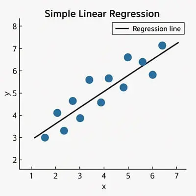

<!-- _class: centered -->
# Введение в машинное обучение
## Регрессия

---
# Что такое Machine Learning?

**Machine Learning (ML)** - технология, которая работает в:
- **Переводчиках** Google Translate
- **Рекомендациях** YouTube, Spotify
- **Автомобилях** Tesla
- **Прогнозах погоды**

ML может предсказывать, рекомендовать, распознавать и генерировать контент.

---
# Как работает ML?

**Machine Learning** - это процесс обучения программы (модели) делать полезные предсказания на основе данных.

**Модель** - это математическая зависимость, которую ML система изучает из данных для предсказаний.

По сути, модель находит **закономерности** в данных и использует их для новых ситуаций.

---
### Пример: Прогноз дождя
**Традиционный подход:**
- Создать физическую модель атмосферы Земли
- Рассчитать уравнения динамики жидкостей
- Вычислить давление, температуру, ветер

**ML подход:**
- Дать модели огромное количество данных о погоде
- Модель сама находит связи между признаками
- Модель учится предсказывать количество осадков

---
# Пример: Цена квартиры

**Традиционный подход:**
```python
if square_meters > 100 and district == "центр":
    price = 50_000_000
elif square_meters > 50 and floor < 5:
    price = 30_000_000
```

**ML подход:**
```python
model.fit(historical_data)  # учится на прошлых продажах
price = model.predict([[площадь, район, этаж]])
# модель сама нашла закономерности
```

---
# Типы ML систем

ML системы делятся на категории по способу обучения:

1. **Supervised Learning** (обучение с учителем)
2. **Unsupervised Learning** (обучение без учителя)
3. **Reinforcement Learning** (обучение с подкреплением)
4. **Generative AI** (генеративный AI)

---
# Supervised Learning (c учителем)

Модель учится на данных с **правильными ответами**.

**Как это работает:**
- Даём модели много данных с известными результатами
- Модель находит связи между признаками и результатами
- Модель готова предсказывать для новых данных

**Два основных типа:** Регрессия и Классификация

---
# Unsupervised Learning (без учителя)

Модель находит закономерности в данных **без правильных ответов**.
**Цель:** выявить скрытые структуры и группы.
**Основной метод: Кластеризация**
- Модель сама находит группы похожих объектов
- Вы не говорите модели, какие группы искать
- Модель выводит собственные правила

---
<!-- _class: centered -->
# Регрессия

---
# Что такое регрессия?

**Регрессия** - модель, которая предсказывает **числовое значение**.

**Примеры:**
- Модель погоды, предсказывающая количество осадков в мм
- Модель недвижимости, предсказывающая цену квартиры
- Модель навигации, предсказывающая время в пути
---
# Примеры задач регрессии

| Сценарий | Входные данные | Числовое предсказание |
|----------|----------------|----------------------|
| Цена дома | Площадь, район, спальни, этаж, налог, кол-во домов на продажу | Цена дома |
| Время в пути | Исторический трафик, расстояние, погода, время суток | Время в минутах |
| Зарплата | Опыт, образование, должность, город, компания | Зарплата в тенге |
| Продажи | Бюджет рекламы, сезон, конкуренты, цена | Объем продаж |

---
<!-- _class: centered -->
# Линейная регрессия

---
**Формула:**
$$y = w_0 + w_1 \cdot x_1 + w_2 \cdot x_2 + ... + w_n \cdot x_n$$

где:
- $y$ - то, что предсказываем (target)
- $w_0$ - базовое значение (intercept)
- $w_1, w_2, ..., w_n$ - коэффициенты (weights)
- $x_1, x_2, ..., x_n$ - признаки (features)

**Пример:**
$$\text{Зарплата} = 200000 + 50000 \cdot \text{Опыт} + 80000 \cdot \text{Образование}$$

---
# Визуализация линейной регрессии

<div class="two-columns">
<div>



</div>
<div>

**Задача модели:**
Найти лучшую линию, которая проходит через точки данных

**Обучение:**
Подбор коэффициентов $w_0, w_1, ..., w_n$ так, чтобы минимизировать ошибку

</div>
</div>

---


1. **Инициализация:** модель начинает со случайных коэффициентов
2. **Предсказание:** модель делает предсказание $\hat{y} = w_0 + w_1 \cdot x$
3. **Ошибка:** вычисляем, насколько ошиблись $error = y_{true} - \hat{y}$
4. **Обновление:** корректируем коэффициенты, чтобы уменьшить ошибку
5. **Повторяем:** шаги 2-4 много раз, пока ошибка не станет минимальной
---
# Признаки (Features) и Target

**Features (X)** - входные данные, характеристики объекта
**Target (y)** - то, что мы хотим предсказать

**Пример: Предсказание цены дома**
- Features: площадь, район, кол-во комнат, этаж, год постройки
- Target: цена (25,000,000 тг)

---

**Типы признаков:**

| Тип | Пример | Как обрабатывать |
|-----|--------|------------------|
| Числовой | Площадь: 65 м² | Как есть или scaling |
| Категориальный | Район: "Алматы" | Encoding (0, 1, 2...) |
| Бинарный | Ремонт: да/нет | 0 или 1 |
| Порядковый | Состояние: плохое/среднее/хорошее | 1, 2, 3 |

---
# Что может быть target для регрессии?

**Требования к target:**
- Должна быть **числом**
- Не должна содержать **пропусков**
- Должна **зависеть** от features

**Примеры:** Цена квартиры: 25,000,000 тг; Зарплата: 450,000 тг/месяц; Время доставки: 45 минут

---
# Train / Test Split

**Проблема:** Как проверить, что модель работает на **новых** данных

**Решение:** Разделить данные на две части

| Часть | % | Назначение |
|-------|---|-----------|
| **Training set** | 70-80% | Обучение модели |
| **Test set** | 20-30% | Проверка модели |

**Критически важно:** модель не должна видеть test данные во время обучения!

---

Когда модель **запоминает** train данные вместо того, чтобы **учиться** на них.

**Признаки overfitting:**
```
Переобученная модель:
Train accuracy: 99%  
Test accuracy:  65%  
Хорошая модель:
Train accuracy: 85%
Test accuracy:  83% 
```
- Слишком сложная модель (запоминает детали); Мало данных для обучения; Слишком много признаков
---
# Метрики качества регрессии

| Метрика | Формула | Значение |
|---------|---------|----------|
| **MAE** | $\frac{1}{n}\sum\|y - \hat{y}\|$ | Средняя ошибка |
| **MSE** | $\frac{1}{n}\sum(y - \hat{y})^2$ | Средний квадрат ошибки |
| **RMSE** | $\sqrt{MSE}$ | Корень из MSE |
| **R²** | $1 - \frac{SS_{res}}{SS_{tot}}$ | Доля объясненной дисперсии |

---
# MAE (Mean Absolute Error)

**Средняя абсолютная ошибка** - среднее отклонение предсказаний.

$$MAE = \frac{1}{n}\sum_{i=1}^{n}|y_i - \hat{y}_i|$$

[100, 200, 300] -> [110, 190, 320]
Ошибки: [10, 10, 20] -> MAE = (10 + 10 + 20) / 3 = **13.3**

**Интерпретация:** В среднем ошибаемся на 13.3 единиц

---
# MSE и RMSE

**MSE (Mean Squared Error)** - средний квадрат ошибки:
$$MSE = \frac{1}{n}\sum_{i=1}^{n}(y_i - \hat{y}_i)^2$$

**RMSE (Root MSE)** - корень из MSE:
$$RMSE = \sqrt{MSE}$$

- Сильнее штрафует большие ошибки; Чувствительнее к выбросам

---
# R² (R-squared)

**Коэффициент детерминации** - доля объясненной дисперсии.
$$R^2 = 1 - \frac{\sum(y_i - \hat{y}_i)^2}{\sum(y_i - \bar{y})^2}$$

**Диапазон:** от -∞ до 1
- **1.0** - идеальная модель
- **0.8-0.9** - очень хорошо
- **0.5-0.7** - нормально

---
# Какую метрику использовать

| Метрика | Когда использовать |
|---------|-------------------|
| **MAE** | Понятная интерпретация, устойчива к выбросам |
| **RMSE** | Важны большие ошибки, чувствительна к выбросам |
| **R²** | Общая оценка качества модели |


---
# Процесс построения ML модели

```
1. Понять задачу
2. Собрать и загрузить данные
3. Исследовать данные (EDA)
4. Предобработка (cleaning, encoding, scaling)
5. Разделить на train/test
6. Обучить модель
7. Сделать предсказания
8. Оценить качество (метрики)
9. Улучшить модель 
```

---
# Ключевые термины

| Термин | Значение |
|--------|----------|
| **Model** | Математическая зависимость для предсказаний |
| **Training** | Процесс обучения модели на данных |
| **Prediction** | Результат работы модели |
| **Features (X)** | Входные характеристики |
| **Target (y)** | То, что предсказываем |
| **Regression** | Предсказание числового значения |
| **Supervised Learning** | Обучение с правильными ответами |
| **Unsupervised Learning** | Обучение без правильных ответов |

