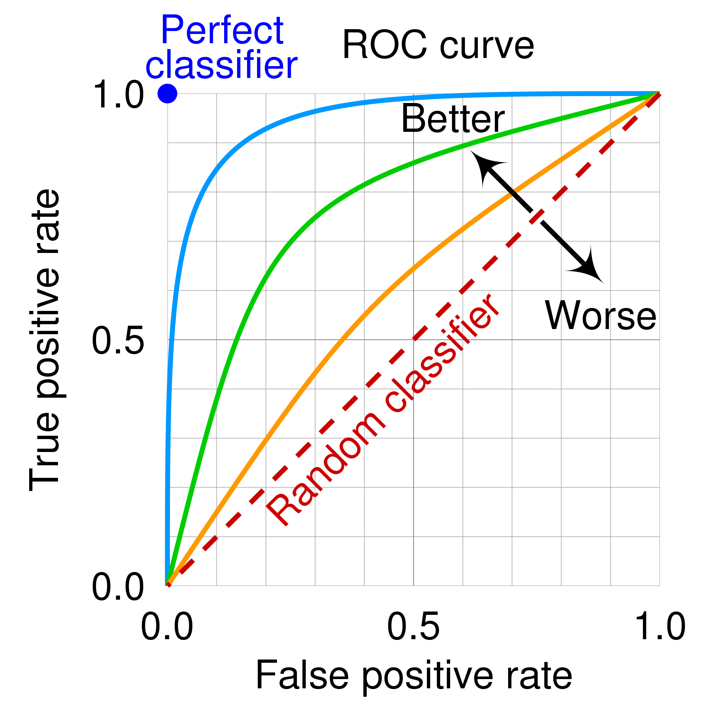

<!-- _class: centered -->
# Логистическая регрессия 

---
# Что мы уже знаем?

**Логистическая регрессия** - классификация (0 или 1)

**Sigmoid функция:**
$$\sigma(z) = \frac{1}{1 + e^{-z}}$$

Где $z = w_0 + w_1 \cdot x_1 + w_2 \cdot x_2 + ... + w_n \cdot x_n$

**Выход:** вероятность от 0 до 1

---
# Binary Cross-Entropy (Log Loss)

$$Loss = -\frac{1}{n} \sum_{i=1}^{n} [y_i \log(\hat{y}_i) + (1-y_i) \log(1-\hat{y}_i)]$$

**Интуиция:**
- Если $y_i = 1$: наказывает, если $\hat{y}_i$ мало (далеко от 1)
- Если $y_i = 0$: наказывает, если $\hat{y}_i$ велико (далеко от 0)
- Всегда **выпуклая функция** -> гарантированная сходимость

---
# Binary Cross-Entropy: примеры

Истинная метка: $y = 1$

| Предсказание $\hat{y}$ | Loss = $-\log(\hat{y})$ |
|------------------------|-------------------------|
| 0.99                   | 0.01                    |
| 0.90                   | 0.10                    |
| 0.50                   | 0.69                    |
| 0.10                   | 2.30                    |
| 0.01                   | 4.61                    |

**Вывод:** Чем дальше от истины, тем больше штраф!

---
# Градиент для логистической регрессии

$$\frac{\partial Loss}{\partial w_0} = \frac{1}{n} \sum_{i=1}^{n} (\hat{y}_i - y_i)$$

$$\frac{\partial Loss}{\partial w_j} = \frac{1}{n} \sum_{i=1}^{n} (\hat{y}_i - y_i) \cdot x_{ij}$$

Где $\hat{y}_i = \sigma(w_0 + w_1 x_{i1} + ... + w_n x_{in})$

**Похоже на линейную регрессию,** Но $\hat{y}_i$ - это sigmoid

---
# Алгоритм градиентного спуска

1. **Инициализация:** $w_0 = 0, w_1 = 0, ..., w_n = 0$

2. **Repeat**:
   - Вычислить предсказания: $\hat{y} = \sigma(Xw)$
   - Вычислить градиенты: $\nabla Loss$
   - Обновить веса: $w := w - \alpha \cdot \nabla Loss$

3. **Stop** когда loss перестает уменьшаться

---
# Hyperparameters

**Learning Rate (α):**
- Слишком большой -> не сходится, "прыгает"
- Слишком маленький -> медленное обучение
- Типичные значения: 0.001 - 0.1

**Iterations:**
- Сколько раз обновляем веса
- Типичные значения: 100 - 10,000

---
# Метрики качества: базовые

**Confusion Matrix:**
|               | Predicted: 0 | Predicted: 1 |
|---------------|--------------|--------------|
| **Actual: 0** | TN           | FP           |
| **Actual: 1** | FN           | TP           |

**Accuracy:**
$$Accuracy = \frac{TP + TN}{TP + TN + FP + FN}$$

**Проблема:** не работает для несбалансированных данных!

---
# Trade-off: Precision vs Recall

**Пример: диагностика рака**

**Высокий Recall (важнее!):**
- Найти всех больных (даже если будут false positives)
- Лучше перестраховаться

**Высокая Precision:**
- Минимизировать false positives
- Не пугать здоровых людей

---
# F1-Score: баланс

$$F1 = 2 \cdot \frac{Precision \cdot Recall}{Precision + Recall}$$

**Гармоническое среднее** Precision и Recall

- F1 = 1.0 -> идеальная модель
- F1 = 0.0 -> худшая модель
- Хорош для несбалансированных данных

Использовать, когда нужен баланс между precision и recall

---
**ROC (Receiver Operating Characteristic):**
- График зависимости True Positive Rate от False Positive Rate, при разных **threshold** (порогах)

**True Positive Rate (TPR):**
$$TPR = \frac{TP}{TP + FN}$$

**False Positive Rate (FPR):**
$$FPR = \frac{FP}{FP + TN}$$

---
# ROC Curve: визуализация

- Диагональ = случайный классификатор (AUC = 0.5)
- Ближе к углу = лучше модель
- AUC = площадь под кривой

---
# AUC (Area Under Curve)

| AUC       | Качество модели             |
|-----------|-----------------------------|
| 0.5       | Случайное угадывание        |
| 0.6 - 0.7 | Плохая модель               |
| 0.7 - 0.8 | Приемлемая модель           |
| 0.8 - 0.9 | Хорошая модель              |
| 0.9 - 1.0 | Отличная модель             |
| 1.0       | Идеальная модель (почему?) |

**AUC** - вероятность, что модель правильно ранжирует случайную пару (positive, negative)

---
# Ключевые формулы
**Sigmoid:**
$$\sigma(z) = \frac{1}{1 + e^{-z}}$$
**Loss:**
$$Loss = -\frac{1}{n} \sum [y_i \log(\hat{y}_i) + (1-y_i) \log(1-\hat{y}_i)]$$
**Update:**
$$w := w - \alpha \cdot \nabla Loss$$