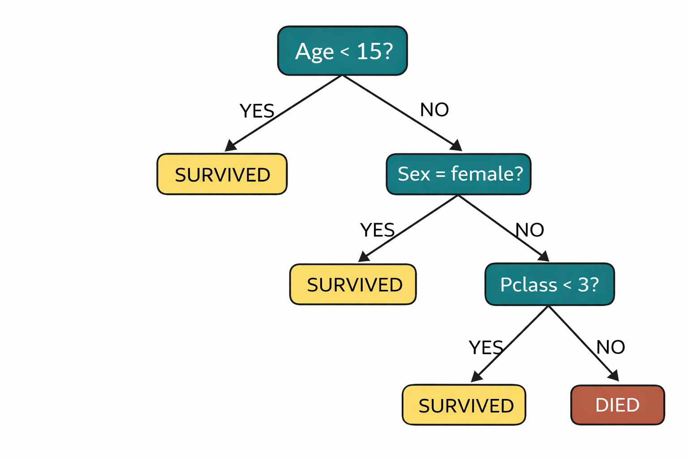

<!-- _class: centered -->
# Деревья решений

---
# Что мы уже знаем?

**Линейная регрессия** - предсказание непрерывных значений
$$y = w_0 + w_1 \cdot x_1 + ... + w_n \cdot x_n$$

**Логистическая регрессия** - бинарная классификация
$$P(y=1) = \frac{1}{1 + e^{-(w_0 + w_1 \cdot x_1 + ...)}}$$

Оба метода строят линейную границу принятия решений

---
# Проблема линейных моделей

Не все данные линейно разделимы:

```
Пример: Предсказание выживания на Титанике
- Age < 10 -> выживет
- Age > 60 AND Pclass = 3 -> не выживет
- Sex = female AND Pclass = 1 -> выживет
```

Это дерево правил, а не линейная функция

---
# Что такое Decision Tree?

**Decision Tree** - это алгоритм, который делит данные с помощью серии if-else вопросов.

**Аналогия:** игра "20 вопросов"
- Это животное? -> Да
- Оно млекопитающее? -> Да  
- Оно больше кошки? -> Нет -> **Ответ:** Кошка

Каждый вопрос делит данные на подгруппы

---
<!-- _class: centered -->
# Структура дерева


---
# Терминология

| Термин | Определение |
|--------|-------------|
| **Root Node** | Начальный узел |
| **Decision Node** | Узел с условием (вопросом) |
| **Leaf Node** | Конечный узел (предсказание) |
| **Splitting** | Разделение узла на два |
| **Branch** | Ветвь дерева (путь) |
| **Depth** | Максимальная длина от корня до листа |

---
# Как дерево выбирает вопросы?

**Цель:** найти признак и порог, которые лучше всего **разделяют** классы.

**Критерии качества разделения:**
1. **Gini Impurity** (используется в sklearn по умолчанию)
2. **Entropy**

Оба измеряют **"чистоту"** узла

---
# Gini Impurity

$$Gini = 1 - \sum_{i=1}^{C} p_i^2$$

где $p_i$ - доля класса $i$ в узле, $C$ - число классов

**Интерпретация:**
- Gini = 0 -> узел **чистый** (все примеры одного класса)
- Gini = 0.5 -> узел **смешанный** (50/50 для бинарной классификации)

---
# Пример: Gini Impurity

**Узел 1:** 90 survived, 10 died
$$Gini = 1 - (0.9^2 + 0.1^2) = 1 - (0.81 + 0.01) = 0.18$$

**Узел 2:** 50 survived, 50 died
$$Gini = 1 - (0.5^2 + 0.5^2) = 1 - (0.25 + 0.25) = 0.5$$

**Узел 3:** 100 survived, 0 died
$$Gini = 1 - (1.0^2 + 0.0^2) = 0$$

Узел 3 - идеально чистый!

---
1. Начать с корня (все данные)
2. Для каждого признака:
   - Попробовать все возможные пороги
   - Вычислить Gini/Entropy для разделения
3. Выбрать **лучшее разделение**
4. Создать два дочерних узла
5. **Рекурсивно повторить** для каждого узла
6. Остановиться, когда:
   - Узел чистый (Gini = 0) -Достигнута максимальная глубина -Слишком мало примеров

---
# Overfitting в деревьях

**Проблема:** деревья легко переобучаются

Без ограничений дерево создаст лист для **каждого** примера из train:
- Train accuracy = 100%
- Test accuracy = 60%

**Почему?** Дерево запоминает шум вместо закономерностей

---
# Pruning (Обрезка)

**Pre-pruning** - остановить рост заранее:
- `max_depth` - максимальная глубина
- `min_samples_split` - минимум примеров для разделения
- `min_samples_leaf` - минимум примеров в листе
- `max_leaf_nodes` - максимум листьев

**Post-pruning** - вырастить полное дерево, потом обрезать
(не используется в sklearn)

---
# Гиперпараметры Decision Tree

| Параметр | Описание | По умолчанию |
|----------|----------|--------------|
| `max_depth` | Максимальная глубина | None (без ограничений) |
| `min_samples_split` | Минимум для разделения | 2 |
| `min_samples_leaf` | Минимум в листе | 1 |
| `criterion` | 'gini' или 'entropy' | 'gini' |
| `max_features` | Число признаков для поиска | None (все) |

---
# Feature Importance

**Важность признака** = насколько он снижает Gini/Entropy в среднем

```python
model.feature_importances_
```

**Интерпретация:**
- Сумма всех важностей = 1.0
- Высокая важность -> признак часто используется
- Важность = 0 -> признак не используется


---
# Decision Trees

**Преимущество:**
- Интуитивно понятны (можно визуализировать)
- Не требуют масштабирования данных
- Работают с категориальными и числовыми признаками
- Feature importance из коробки
- Нелинейные границы решений

---
# Регрессия и Классификация

**DecisionTreeClassifier:**
- Листья содержат класс (0 или 1)
- Критерий: Gini или Entropy

**DecisionTreeRegressor:**
- Листья содержат среднее значение
- Критерий: MSE (Mean Squared Error)


---
# Сравнение с Logistic Regression

| Аспект | Logistic Regression | Decision Tree |
|--------|---------------------|---------------|
| Граница | Линейная | Нелинейная  |
| Интерпретируемость | Коэффициенты | Визуализация дерева |
| Overfitting | Меньше склонна | Очень склонна |
| Масштабирование | Требуется | Не требуется |
| Скорость | Быстрее | Медленнее на больших данных |

---
**Хорошо подходят:**
- Данные с явными if-else правилами
- Нужна интерпретируемость
- Смешанные типы признаков
- Прототипирование (быстро попробовать)

**Не подходят:**
- Линейно разделимые данные
- Нужна максимальная точность
- Большие данные -> деревья медленнее

---

## Decision Trees - это основа для ансамблей:

**Random Forest:**
- Меньше overfitting
- Выше точность

**Gradient Boosting (XGBoost, LightGBM, CatBoost):**
- Деревья обучаются последовательно
- Каждое исправляет ошибки предыдущих