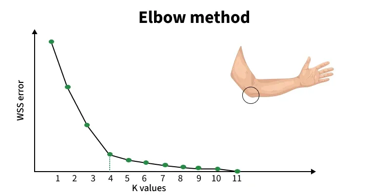

<!-- _class: centered -->
# Unsupervised Learning
## K-Means Clustering

---
# Что мы уже знаем?

**Supervised Learning (обучение с учителем)**
У нас есть данные **с правильными ответами**:
- **Регрессия:** предсказываем зарплату, цену дома
- **Классификация:** болен/здоров, спам/не спам

**Формат данных:**
| Опыт | Образование | → | Зарплата |
|------|-------------|---|----------|
| 2    | Бакалавр    | → | 300,000  |
| 5    | Магистр     | → | 550,000  |

---
# Новая задача

**Что если у нас нет правильных ответов?**

| Возраст | Доход    | Траты   | → | ??? |
|---------|----------|---------|---|-----|
| 25      | 500,000  | 200,000 | → | ??? |
| 45      | 2,000,000| 800,000 | → | ??? |

**Вопрос:** Можем ли мы найти закономерности в данных?

---
# Unsupervised Learning

**Обучение без учителя** - модель находит закономерности **сама**

**Нет** целевой переменной (target)
**Нет** правильных ответов
**Цель:** найти скрытые структуры в данных

---


**1. Кластеризация (Clustering)**
- Группировка похожих объектов
- Сегментация клиентов, группировка документов

**2. Снижение размерности**
- PCA, t-SNE
- Уменьшение числа признаков

**3. Поиск аномалий**
- Обнаружение мошенничества, дефектов

---
<!-- _class: centered -->
# Кластеризация

---
# Что такое кластеризация?!

**Кластеризация** = группировка объектов по схожести

**Цель:**
- Объекты **внутри** кластера похожи
- Объекты из **разных** кластеров отличаются

**Аналогия:** Сортировка фруктов по типу
- Яблоки в одну корзину
- Апельсины в другую

---
# Примеры применения

| Область | Задача |
|---------|--------|
| **Маркетинг** | Сегментация клиентов по поведению |
| **Розничная торговля** | Группировка товаров |
| **Медицина** | Группировка пациентов по симптомам |
| **Соцсети** | Поиск сообществ по интересам |
| **Изображения** | Сжатие изображений (цветовая палитра) |

---
**Пример:** **Данные о студентах:**
- Часы подготовки в неделю
- Средний балл
- Посещаемость занятий (%)
**-----**
- Кластер 1: "Много учатся, высокая успеваемость, высокая посещаемость"
- Кластер 2: "Средне учатся, средняя успеваемость, иногда пропускают"
- Кластер 3: "Мало учатся, низкие оценки, часто пропускают"

---
<!-- _class: centered -->
# K-Means Algorithm

---
# Что такое K-Means?

**K-Means** - самый популярный алгоритм кластеризации

**K** = количество кластеров (выбираем заранее)
**Means** = средние значения (центроиды)

**Идея:** Найти K центров кластеров так, чтобы точки были близко к своему центру

---
# Как работает K-Means?
1. **Выбираем K** (например, K=3 кластера)
2. **Инициализация:** случайно размещаем K центроидов
3. **Повторяем:**
   - **Assign:** каждую точку относим к ближайшему центроиду
   - **Update:** пересчитываем центроиды (среднее точек в кластере)
4. **Стоп:** когда центроиды перестают двигаться

---
# Визуализация K-Means

---
# Метрика расстояния

**Евклидово расстояние** - расстояние "по прямой"

$$d(A, B) = \sqrt{(x_2 - x_1)^2 + (y_2 - y_1)^2}$$

**Пример:**
- Точка A: (2, 3)
- Точка B: (5, 7)
- Расстояние = $\sqrt{(5-2)^2 + (7-3)^2} = \sqrt{9 + 16} = 5$

---
# Feature Scaling для K-Means

**Проблема:**

| Возраст | Доход (₸) |
|---------|-----------|
| 25      | 500,000   |
| 45      | 2,000,000 |

Доход доминирует из-за масштаба

---
# Как выбрать K?

**Проблема:** Сколько кластеров создать?

**Решение:** Elbow Method (метод локтя)

**Идея:**
1. Запустить K-Means для K = 1, 2, 3, ..., 10
2. Вычислить **Inertia** (WCSS) для каждого K
3. Построить график
4. Найти оптимальный K на графике

---
# Inertia (WCSS)

**Inertia** = сумма квадратов расстояний точек до их центроидов

$$Inertia = \sum_{i=1}^{K}\sum_{x \in C_i}||x - \mu_i||^2$$

**Интерпретация:**
- **Меньше** = кластеры компактнее (точки ближе к центрам)
- **Больше** = кластеры рыхлые


---

Оптимальное K = 4
- После K=4 уменьшение Inertia замедляется
- Добавление кластеров не дает большой пользы

---
# Преимущества K-Means

- Простой и понятный
- Быстрый (работает на больших данных)
- Хорошо масштабируется
- Легко реализовать

---
# Недостатки K-Means

- Нужно заранее выбрать K
- Чувствителен к начальной инициализации
- Плохо работает с кластерами разной формы/размера
- Чувствителен к выбросам


---
# K-Means++

**K-Means++** - улучшенная инициализация центроидов

**Отличие от обычного K-Means:**
- Не случайные начальные центроиды
- Выбирает их умнее (далеко друг от друга)

**Результат:**
- Более стабильные результаты
- Быстрее сходится и меньше зависит от случайности

---
# Процесс работы с K-Means

```
1. Загрузить и изучить данные (EDA)
2. Выбрать признаки для кластеризации
3. Feature Scaling (StandardScaler)
4. Elbow Method → выбрать K
5. Обучить KMeans(n_clusters=K)
6. Получить метки кластеров
7. Визуализировать результаты
8. Интерпретировать кластеры
9. Применить инсайты (маркетинг, сегментация)
```
---
# Контрольные вопросы

1. В чем отличие Supervised от Unsupervised Learning?
2. Что такое кластеризация?
3. Как работает алгоритм K-Means?
4. Зачем нужен Feature Scaling для K-Means?
5. Что такое Elbow Method?
6. Как интерпретировать результаты кластеризации?