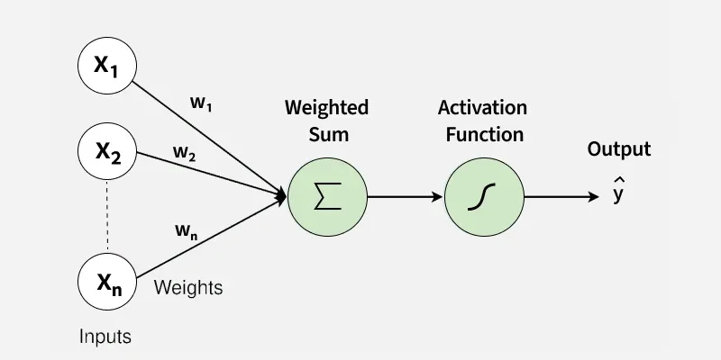
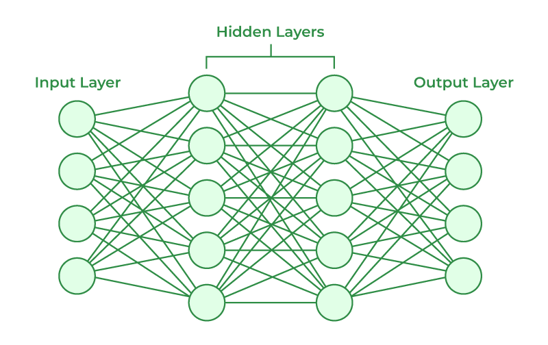

<!-- _class: centered -->
# Введение в нейронные сети
## Neural Networks

---
# Что такое нейронная сеть?

**Нейронная сеть** - это математическая модель, вдохновлённая работой мозга

**Основные компоненты:**
- Нейроны (nodes/units)
- Связи между нейронами 
- Функции активации
- Слои (layers)

---
**Биологический нейрон:**
- Принимает сигналы от других нейронов
- Обрабатывает информацию
- Передаёт сигнал дальше

**Искусственный нейрон:**
- Принимает входы (inputs)
- Умножает на веса (weights)
- Применяет функцию активации
- Выдаёт результат (output)

---
# Простейший нейрон (Perceptron)




$$z = w_1 \cdot x_1 + w_2 \cdot x_2 + ... + w_n \cdot x_n + b$$
$$output = f(z)$$

где $b$ - bias (смещение), $f$ - функция активации

---
# Это линейная регрессия?

**Да, но с функцией активации:**

**Linear Regression:**
$$y = w_1 \cdot x_1 + w_2 \cdot x_2 + ... + b$$

**Нейрон:**
$$y = f(w_1 \cdot x_1 + w_2 \cdot x_2 + ... + b)$$

**Функция активации** добавляет нелинейность

---
# Функции активации

 Без нелинейности нейронная сеть = линейная регрессия

**Популярные функции:**
- **ReLU** (Rectified Linear Unit): $f(x) = max(0, x)$
- **Sigmoid**: $f(x) = \frac{1}{1 + e^{-x}}$
- **Tanh**: $f(x) = \frac{e^x - e^{-x}}{e^x + e^{-x}}$
- **Softmax**: для многоклассовой классификации

---
# ReLU - самая популярная

$$f(x) = max(0, x)$$

- Если $x < 0$, то $f(x) = 0$
- Если $x \geq 0$, то $f(x) = x$

**Преимущества:**
- Простая и быстрая
- Хорошо работает на практике


---
**Слои (Layers):**
1. **Input Layer** - входной слой (признаки)
2. **Hidden Layers** - скрытые слои (обработка)
3. **Output Layer** - выходной слой (результат)


---
# Полносвязная сеть (Dense/Fully Connected)

**Каждый нейрон связан со всеми нейронами следующего слоя**



---
# Forward Propagation

**Прямое распространение** - вычисление выхода сети

1. Берём входы $x_1, x_2, ..., x_n$
2. Умножаем на веса первого слоя
3. Применяем функцию активации
4. Результат передаём следующему слою
5. Повторяем до выходного слоя

**Выходит цепочка вычислений**

---
# Пример Forward Propagation

**Входы:** $x_1 = 2, x_2 = 3$
**Скрытый слой** (1 нейрон):
$$z_1 = w_{11} \cdot 2 + w_{12} \cdot 3 + b_1 = 0.5 \cdot 2 + 0.3 \cdot 3 + 0.1 = 2.0$$
$$a_1 = ReLU(2.0) = 2.0$$

**Выходной слой:**
$$z_2 = w_{21} \cdot 2.0 + b_2 = 0.7 \cdot 2.0 + 0.2 = 1.6$$
$$\hat{y} = Sigmoid(1.6) = 0.832$$

---
# Обучение нейронной сети

**Как подбираются веса?**

1. **Инициализация** - случайные веса
2. **Forward Propagation** - получаем предсказание
3. **Вычисление ошибки** - Loss Function
4. **Backward Propagation** - обновление весов
5. **Повторяем** много раз

---
# Loss Function

**Регрессия:**
- MSE: $Loss = \frac{1}{n}\sum(y - \hat{y})^2$
- MAE: $Loss = \frac{1}{n}\sum|y - \hat{y}|$

**Бинарная классификация:**
- Binary Cross-Entropy: $Loss = -\frac{1}{n}\sum[y \log(\hat{y}) + (1-y)\log(1-\hat{y})]$

---
# Backpropagation (концептуально)

**Обратное распространение ошибки**

1. Вычисляем ошибку на выходе
2. Распространяем ошибку назад по сети
3. Вычисляем градиенты (производные)
4. Обновляем веса: $w_{new} = w_{old} - \alpha \cdot \frac{\partial Loss}{\partial w}$

где $\alpha$ - learning rate (скорость обучения)

**Это Gradient Descent, но для всей сети**

---
# Эпохи, батчи, итерации

**Epoch (эпоха)** - один полный проход по всем данным

**Batch (батч)** - порция данных для одного обновления весов

**Iteration (итерация)** - одно обновление весов

**Пример:** 1000 примеров, batch size = 100
- 1 эпоха = 10 итераций

---
**TensorFlow** - библиотека для глубокого обучения от Google
**Keras** - высокоуровневый API для TensorFlow

```python
model = keras.Sequential([
    layers.Dense(8, activation='relu', input_shape=(4,)),
    layers.Dense(4, activation='relu'),
    layers.Dense(1, activation='sigmoid')
])

model.compile(optimizer='adam',
              loss='binary_crossentropy',
              metrics=['accuracy'])

model.fit(X_train, y_train, epochs=50, batch_size=32)
```

---
# Структура модели в Keras

```python
model = keras.Sequential([
    layers.Dense(8, activation='relu', input_shape=(4,)),
    layers.Dense(4, activation='relu'),
    layers.Dense(1, activation='sigmoid')
])
```

**Dense** - полносвязный слой
**activation** - функция активации
**input_shape** - размер входа (только в первом слое)

---
# Компиляция модели

```python
model.compile(
    optimizer='adam',      # алгоритм оптимизации
    loss='binary_crossentropy',  # функция потерь
    metrics=['accuracy']   # метрики для отслеживания
)
```

**Optimizer:**
- 'adam' - самый популярный (adaptive moment estimation)
- 'sgd' - stochastic gradient descent
- 'rmsprop'

---
# Обучение модели

```python
history = model.fit(
    X_train, y_train,
    epochs=50,          # сколько раз пройти по данным
    batch_size=32,      # размер батча
    validation_split=0.2  # 20% для валидации
)
```

**history** - история обучения (loss, accuracy по эпохам)

---
# Использование модели

```python
# Предсказание
predictions = model.predict(X_test)

# Для классификации: преобразуем вероятности в классы
y_pred = (predictions > 0.5).astype(int)

# Оценка
from sklearn.metrics import accuracy_score
accuracy = accuracy_score(y_test, y_pred)
```

---
### Когда использовать нейронные сети?

- Большие объёмы данных
- Сложные нелинейные зависимости
- Изображения, текст, звук
- Задачи с высокой размерностью

**Не обязательно использовать:**
- Малые датасеты (< 1000 примеров)
- Простые линейные зависимости
- Ограниченные вычислительные ресурсы

---
- **Нейрон** - вычисляет взвешенную сумму и активацию
- **Слой** - группа нейронов
- **Веса** - параметры, которые обучаются
- **Bias** - смещение
- **Функция активации** - вносит нелинейность
- **Forward propagation** - вычисление выхода
- **Backpropagation** - обновление весов
- **Epoch** - полный проход по данным
- **Batch** - порция данных

