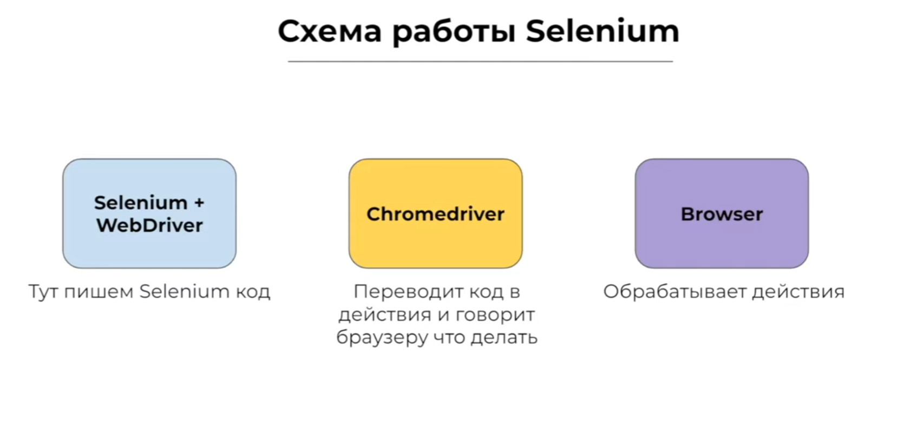

<!-- _class: centered -->


## Web Scraping с Selenium

### Сбор данных с веб-страниц

---

## Что такое Web Scraping?

**Web Scraping (веб-скрапинг)** - автоматическое извлечение данных с веб-страниц.

### Зачем это нужно?
-  Сбор данных для анализа
-  Мониторинг цен конкурентов
-  Агрегация новостей
-  Исследование рынка
-  Научные исследования

---

### BeautifulSoup
-  Быстрая работа
-  Простой синтаксис
-  Легковесная
-  Только статический HTML

### Selenium
-  Динамический контент
-  Взаимодействие (клики, формы)
-  Медленнее 


---

## Установка

### 1. Установка Selenium

```bash
pip install selenium
```

### 2. Установка драйвера 

```bash
pip install webdriver-manager
```


---


---


```python
from selenium import webdriver
from selenium.webdriver.chrome.service import Service
from webdriver_manager.chrome import ChromeDriverManager

# Создаём драйвер
driver = webdriver.Chrome(
    service=Service(ChromeDriverManager().install())
)

# Открываем страницу
driver.get("https://www.example.com")

# Получаем заголовок
print(driver.title)

# Закрываем браузер
driver.quit()
```

---

## Поиск элементов на странице

### Основные методы

| Метод | Описание | Пример |
|-------|----------|--------|
| `By.ID` | По ID атрибуту | `"user-name"` |
| `By.CLASS_NAME` | По классу | `"btn-primary"` |
| `By.TAG_NAME` | По тегу | `"h1"` |
| `By.CSS_SELECTOR` | CSS селектор | `"div.content p"` |
| `By.XPATH` | XPath выражение | `"//div[@class='item']"` |

---

## Поиск элементов: примеры

```python
from selenium.webdriver.common.by import By

# Один элемент
title = driver.find_element(By.TAG_NAME, "h1")
print(title.text)

# Несколько элементов
paragraphs = driver.find_elements(By.TAG_NAME, "p")
for p in paragraphs:
    print(p.text)

# CSS селектор
items = driver.find_elements(By.CSS_SELECTOR, "div.item")

# XPath
button = driver.find_element(By.XPATH, "//button[@id='submit']")
```

---

## Извлечение данных из таблицы

```python
# Находим таблицу
table = driver.find_element(By.ID, "sales-table")

# Извлекаем заголовки
headers = table.find_elements(By.TAG_NAME, "th")
header_names = [h.text for h in headers]

# Извлекаем строки данных
rows = table.find_elements(By.CSS_SELECTOR, "tbody tr")
data = []

for row in rows:
    cells = row.find_elements(By.TAG_NAME, "td")
    row_data = [cell.text for cell in cells]
    data.append(row_data)

# Создаём DataFrame
df = pd.DataFrame(data, columns=header_names)
```

---

## Работа с динамическим контентом

Многие сайты загружают данные через **JavaScript**.  
Обычные запросы не видят этот контент.

### Решение
Selenium ждёт загрузки элементов:

```python
from selenium.webdriver.support.ui import WebDriverWait
from selenium.webdriver.support import expected_conditions as EC

wait = WebDriverWait(driver, 10)
element = wait.until(
    EC.presence_of_element_located((By.CLASS_NAME, "item"))
)
```

---

## Взаимодействие с элементами

### Клики

```python
button = driver.find_element(By.ID, "load-btn")
button.click()
```

### Ввод текста

```python
input_field = driver.find_element(By.NAME, "username")
input_field.send_keys("my_username")
```

### Очистка поля

```python
input_field.clear()
```

---

## Прокрутка страницы

### Прокрутка вниз

```python
driver.execute_script("window.scrollTo(0, document.body.scrollHeight);")
```

### Прокрутка вверх

```python
driver.execute_script("window.scrollTo(0, 0);")
```

### Прокрутка к элементу

```python
element = driver.find_element(By.ID, "footer")
driver.execute_script("arguments[0].scrollIntoView();", element)
```

---

## Сохранение данных


```python
import pandas as pd

# Собираем данные
products_data = []
products = driver.find_elements(By.CLASS_NAME, "product")

for product in products:
    name = product.find_element(By.CLASS_NAME, "name").text
    price = product.find_element(By.CLASS_NAME, "price").text
    products_data.append({'Название': name, 'Цена': price})

# DataFrame
df = pd.DataFrame(products_data)
```

---

## Сохранение в CSV

```python
# Сохранение
df.to_csv('products.csv', index=False, encoding='utf-8-sig')

df_loaded = pd.read_csv('products.csv')
print(df_loaded.head())
```

### Параметры:
- `index=False` - не сохранять индексы
- `encoding='utf-8-sig'` - корректная кириллица в Excel

---

## Headless режим

**Headless** - браузер работает в фоне, без открытия окна.

```python
from selenium.webdriver.chrome.options import Options

chrome_options = Options()
chrome_options.add_argument("--headless")
chrome_options.add_argument("--no-sandbox")
chrome_options.add_argument("--disable-dev-shm-usage")

driver = webdriver.Chrome(
    service=Service(ChromeDriverManager().install()),
    options=chrome_options
)
```

### Преимущества:
- 🚀 Быстрее работает
- 💻 Меньше ресурсов
- 🤖 Подходит для серверов

---


### Автоматическое закрытие браузера

```python
from contextlib import contextmanager

@contextmanager
def get_driver():
    driver = webdriver.Chrome(
        service=Service(ChromeDriverManager().install())
    )
    try:
        yield driver
    finally:
        driver.quit()

with get_driver() as driver:
    driver.get("https://www.example.com")
    print(driver.title)
```


---

### Плохие практики

1.  Скрапинг закрытых/личных данных
2.  Перегрузка сервера (слишком частые запросы)
3.  Игнорирование Terms of Service
4.  Не закрывать драйвер (утечка памяти)
5.  Хранение пароли в коде 


---

## Selenium: преимущества и недостатки

### Преимущества
- Работает с JavaScript
- Реальный браузер
- Клики и формы
- Ожидание загрузки
- Скриншоты страниц
- Кроссбраузерность

---
## Selenium: преимущества и недостатки
### Недостатки
- Медленная работа
- Требует браузер/драйвер
- Больше ресурсов
- Сложнее настройка
- Может детектироваться сайтами


---

## Полезные методы Selenium

```python
# Получить HTML элемента
html = element.get_attribute('innerHTML')

# Получить атрибут
href = link.get_attribute('href')

# Проверка видимости
is_visible = element.is_displayed()

# Размер и позиция
size = element.size
location = element.location

# Скриншот
driver.save_screenshot('screenshot.png')
element.screenshot('element.png')
```

---

## Работа с несколькими вкладками

```python
# Открыть новую вкладку
driver.execute_script("window.open('');")

# Получить все вкладки
tabs = driver.window_handles

# Переключиться на вторую вкладку
driver.switch_to.window(tabs[1])
driver.get("https://example.com")

# Вернуться на первую вкладку
driver.switch_to.window(tabs[0])

# Закрыть текущую вкладку
driver.close()
```

---

## Работа с cookies

```python
# Получить все cookies
cookies = driver.get_cookies()
print(cookies)

# Добавить cookie
driver.add_cookie({
    'name': 'test_cookie',
    'value': 'test_value'
})

# Получить конкретный cookie
cookie = driver.get_cookie('test_cookie')

# Удалить cookie
driver.delete_cookie('test_cookie')

# Удалить все cookies
driver.delete_all_cookies()
```

---

#### Полезные ресурсы

#####  Документация
- [Selenium Documentation](https://www.selenium.dev/documentation/)
- [WebDriver Manager](https://github.com/SergeyPirogov/webdriver_manager)

##### Обучение
- [Real Python: Web Scraping](https://realpython.com/python-web-scraping-practical-introduction/)
- [Selenium Python Bindings](https://selenium-python.readthedocs.io/)

#####  Этика
- [Web Scraping Best Practices](https://www.scraperapi.com/blog/web-scraping-best-practices/)
