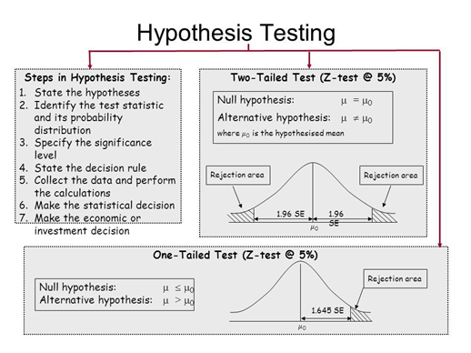

<!-- _class: centered -->

# Статистика 

### Распределения, гипотезы, тесты, доверительные интервалы

---

<!-- _class: centered -->

# Описательная статистика

---


**Mean (среднее):** сумма / кол-во
- Чувствительна к выбросам
- Хороша при симметричном распределении

**Median (медиана):** середина отсортированного ряда
- Устойчива к выбросам
- Хороша при скошенных данных

**Mode (мода):** наиболее частое значение
- Используется для категориальных данных

---

# Когда что использовать?

| Ситуация | Рекомендация |
|----------|-------------|
| Зарплаты, цены на жильё | **Median** - выбросы искажают mean |
| Рост людей, IQ | **Mean** - распределение близко к нормальному |
| Размер одежды, категории товаров | **Mode** |
| Оценки студентов с отличниками | **Median** |

 **Правило:** если mean ≠ median -> данные скошены

---

# Меры разброса

**Variance (дисперсия):** средний квадрат отклонений от mean
$$\sigma^2 = \frac{\sum(x_i - \bar{x})^2}{n}$$

**Std (стандартное отклонение):** $\sigma = \sqrt{\sigma^2}$
- в тех же единицах, что и данные

**IQR (межквартильный размах):** Q3 − Q1
- устойчив к выбросам, используется в boxplot

---


<div class="two-columns">

<div>

**Правый скос (positive):**
- Tail уходит вправо
- Mean > Median
- Типично: зарплаты, цены

**Левый скос (negative):**
- Tail уходит влево
- Mean < Median
- Типично: возраст выхода на пенсию

</div>

<div>

**Нулевой скос:**
- Симметричное распределение
- Mean ≈ Median
- Нормальное распределение
</div>
</div>

---

<!-- _class: centered -->

# Распределения

---

# Нормальное распределение

**Колоколообразная форма**, симметрична вокруг среднего.

**Правило 68-95-99.7:**
- **68%** значений в пределах **±1σ** от mean
- **95%** значений в пределах **±2σ** от mean
- **99.7%** значений в пределах **±3σ** от mean

Рост, вес - часто нормальны

---

# Нормальное распределение

$$f(x) = \frac{1}{\sigma\sqrt{2\pi}} e^{-\frac{(x-\mu)^2}{2\sigma^2}}$$

Но нам важен практический смысл:

- Если рост в среднем 68" ± 2" (std), значит 95% людей имеют рост **от 64" до 72"**
- Выброс - это значение дальше ±3σ (только 0.3% случаев)

---

# Проверка нормальности

**Зачем?** Многие тесты требуют нормального распределения.

**Способы проверить:**
1. **Гистограмма** - визуально колоколообразная форма
2. **Q-Q plot** - точки лежат на прямой линии
3. **Shapiro-Wilk тест** - статистическая проверка

```python
from scipy import stats
stat, p_value = stats.shapiro(data)
# p > 0.05 -> нормальное распределение
```

---

# Центральная предельная теорема 

**Суть:** Если брать достаточно большие выборки из **любого** распределения и считать их средние - эти средние будут нормально распределены.

**Почему это важно:**
- Позволяет применять нормальные тесты даже к ненормальным данным
- Работает при **n ≥ 30** (обычно)
- Основа большинства статистических методов


---

**Биномиальное:** число успехов в n испытаниях
- Пример: сколько из 100 монет выпало орлом?

**Пуассона:** число событий за единицу времени
- Пример: сколько звонков в колл-центр за час?

**Равномерное:** все значения одинаково вероятны
- Пример: бросок кубика

> Для аналитика важно знать, что распределения бывают разные - это влияет на выбор теста

---

<!-- _class: centered -->

# Доверительные интервалы

---


**Доверительный интервал (CI)** - диапазон значений, в котором с заданной вероятностью находится истинный параметр генеральной совокупности.

**95% CI [142, 158]** означает:
> Если повторять эксперимент 100 раз, в 95 случаях из 100 истинное среднее попадёт в этот интервал

**Не означает:**
> "С 95% вероятностью среднее равно числу в этом диапазоне"

---

# Формула CI для среднего

$$CI = \bar{x} \pm t^* \cdot \frac{s}{\sqrt{n}}$$

Где:
- $\bar{x}$ - выборочное среднее
- $s$ - стандартное отклонение выборки
- $n$ - размер выборки
- $t^*$ - критическое значение t-распределения (≈ 1.96 для 95% при больших n)

---

# Влияние размера выборки

**Больше данных -> уже интервал -> точнее оценка**

| n | 95% CI ширина (пример) |
|---|------------------------|
| 10 | ±12.5 |
| 100 | ±3.9 |
| 1000 | ±1.2 |
| 10000 | ±0.4 |

> Маленькая выборка -> широкий CI -> **нельзя делать уверенные выводы**

---


**Пример:** средний чек клиента = 1500, 95% CI [1420, 1580]

**Вывод:**
- Мы достаточно уверены в диапазоне
- Планируем маркетинг, ожидая средний чек **не ниже 1420**

**Если CI = [900, 2100]:**
- Слишком широкий - нужно больше данных
- С такой неопределённостью сложно принимать решения

---

<!-- _class: centered -->

# Проверка гипотез

---


**H₀ (нулевая гипотеза):** "Ничего особенного не происходит"
- Различий нет, эффекта нет, зависимости нет

**H₁ (альтернативная гипотеза):** "Есть что-то интересное"
- Различие существует, эффект есть

**Примеры:**
| H₀ | H₁ |
|----|-----|
| Средний рост мужчин = 170 см | Средний рост ≠ 170 см |
| Пол не влияет на выживаемость | Пол влияет на выживаемость |
| Зарплаты Senior = Junior | Зарплаты Senior > Junior |

---


**p-value** - вероятность получить такой же (или более экстремальный) результат, **если H₀ верна**.

**Малый p-value (< 0.05):**
- Такой результат очень маловероятен при H₀
- Отвергаем H₀, принимаем H₁

**Большой p-value (≥ 0.05):**
- Такой результат нормален при H₀
- Нет оснований отвергнуть H₀

---


---

# p-value - частые ошибки

 **"p < 0.05 - значит H₁ точно верна"**
 Мы лишь говорим, что H₀ маловероятна

 **"p = 0.8 - значит H₀ точно верна"**
 Мы лишь не нашли оснований её отвергнуть

 **"p-value - это вероятность что H₀ верна"**
 Это вероятность данных при условии верности H₀

> **Правило:** статистическая значимость ≠ практическая значимость

---

# Уровень значимости α

**α** - порог, при котором мы готовы "ошибиться"

- Стандарт: **α = 0.05** (5%)
- Строже: **α = 0.01** (медицина, наука)
- Мягче: **α = 0.10** (разведочный анализ)

**Правило:** p < α -> отвергаем H₀

---


|  | H₀ верна | H₀ ложна |
|--|---------|---------|
| **Отвергли H₀** |  Ошибка I рода (α) |  Верно |
| **Не отвергли H₀** |  Верно |  Ошибка II рода (β) |

**Ошибка I рода (False Positive):** "Нашли эффект, которого нет"
- Вероятность = α = 0.05

**Ошибка II рода (False Negative):** "Не нашли реальный эффект"
- Растёт при малой выборке

---

# Условия применимости тестов


1. **Размер выборки:** n < 30 - результаты ненадёжны
2. **Нормальность:** параметрические тесты требуют нормального распределения (или n ≥ 30 по ЦПТ)
3. **Независимость:** наблюдения не должны зависеть друг от друга
4. **Однородность дисперсий:** для некоторых тестов 

> Нарушение условий = ненадёжный результат, даже если p < 0.05

---

<!-- _class: centered -->

# Статистические тесты

---

# Как выбрать тест?

```
Что сравниваем?
│
├── Числовые данные
│   ├── 1 группа -> Одновыборочный t-тест
│   ├── 2 группы -> Нормальные? 
│   │   ├── Да -> Двухвыборочный t-тест
│   │   └── Нет -> Mann-Whitney U
│   └── 3+ групп -> ANOVA
│
└── Категориальные данные
    └── Зависимость между категориями -> Chi-squared тест
```

---


**Одновыборочный:** сравниваем выборку с известным значением
```python
t_stat, p_value = stats.ttest_1samp(data, popmean=67)
```

**Двухвыборочный:** сравниваем две группы
```python
t_stat, p_value = stats.ttest_ind(group_a, group_b)
```

- Данные числовые
- Нормальное распределение (или n ≥ 30)
- Независимые наблюдения

---

# Chi-squared тест (χ²)

Зависимость между **двумя категориальными** переменными

```python
from scipy import stats
contingency_table = pd.crosstab(df['Sex'], df['Survived'])
chi2, p_value, dof, expected = stats.chi2_contingency(contingency_table)
```

**Условия:**
- Оба признака категориальные
- Ожидаемая частота в каждой ячейке ≥ 5
- Если ячейки с маленькими частотами - тест ненадёжен

---

# Mann-Whitney U тест

Сравниваем две группы, когда **распределение ненормальное**

```python
stat, p_value = stats.mannwhitneyu(group_a, group_b, alternative='two-sided')
```

**Условия:**
- Данные хотя бы порядковые
- Независимые выборки
- Не требует нормальности


---

<!-- _class: centered -->

# Корреляция и причинность

---

# Корреляция Пирсона и Спирмена

<div class="two-columns">

<div>

**Pearson:**
- Линейная связь
- Требует нормальность
- Чувствителен к выбросам
- Значение: от -1 до +1

```python
r, p = stats.pearsonr(x, y)
```

</div>

<div>

**Spearman:**
- Монотонная связь (не обязательно линейная)
- Не требует нормальности
- Устойчив к выбросам
- Работает с рангами

```python
r, p = stats.spearmanr(x, y)
```

</div>
</div>

---

# Интерпретация корреляции

| r | Интерпретация |
|---|---------------|
| 0.9 – 1.0 | Очень сильная положительная |
| 0.7 – 0.9 | Сильная положительная |
| 0.5 – 0.7 | Умеренная положительная |
| 0.3 – 0.5 | Слабая положительная |
| 0.0 – 0.3 | Очень слабая / нет |
| Отрицательные | То же, но обратная связь |

> Всегда стоит проверять p-value: r = 0.8 при n = 5 - незначимая корреляция!

---

# Корреляция ≠ Причинность

**Пример 1:** Продажи мороженого коррелируют с утоплениями
-> Причина: жаркая погода влияет на оба события

**Пример 2:** Количество пиратов коррелирует с глобальным потеплением
-> Совпадение временных трендов

> Чтобы доказать причинность - нужен эксперимент (например A/B тест)

---

<!-- _class: centered -->
# Мини-кейсы

### Применяем статистику для обоснования выводов

---

# Кейс 1: Рост и норма

**Вопрос:** Средний рост в нашей выборке статистически отличается от нормы 67.0 дюймов?

**Гипотезы:**
- H₀: μ = 67.0
- H₁: μ ≠ 67.0

**Тест:** Одновыборочный t-тест (n = 25000, нормальность ожидаема)

---

# Кейс 2: Выживаемость на Титанике

**Вопрос:** Зависит ли выживаемость от пола пассажира?

**Гипотезы:**
- H₀: Пол и выживаемость независимы
- H₁: Есть зависимость между полом и выживаемостью

**Тест:** Chi-squared (обе переменные категориальные)

**Проверяем условия:** ожидаемые частоты в каждой ячейке ≥ 5?

---

# Кейс 3: Зарплаты Senior vs Mid-level

**Вопрос:** Senior-инженеры зарабатывают статистически значимо больше?

- H₀: Зарплаты SE и MI не отличаются
- H₁: Зарплаты SE > MI

**Проверяем условия:**
- Shapiro-Wilk: распределение нормальное? 
- n(SE) = 10670, n(MI) = 4038 - выборки большие 

---


**Признаки ненадёжного результата:**

- **n < 30:** "Среди 10 клиентов конверсия выросла с 10% до 20% - значит кампания сработала" -> слишком мало данных
- **Широкий CI:** "Средний чек вырос" - смотрим CI, если [−50, +200] - вывод ненадёжен  
- **Нарушены условия теста:** применили t-тест к сильно скошенным данным без проверки
- **Множественные сравнения:** сравниваем 20 групп - 1 "значимый" результат появится случайно

---

# Чеклист перед выводом

 Размер выборки достаточен (n ≥ 30)  
 Проверена нормальность (или выбран непараметрический тест)  
 Условия выбранного теста соблюдены  
 p-value интерпретируется правильно  
 Построен доверительный интервал  

---


# Итог

| Задача | Инструмент |
|--------|-----------|
| Описание данных | mean, median, std, IQR |
| Форма распределения | histogram, Q-Q plot, Shapiro-Wilk |
| Оценка с неопределённостью | Доверительный интервал |
| "Есть ли различие?" | t-тест, Mann-Whitney |
| "Есть ли зависимость?" | Chi-squared, корреляция |


