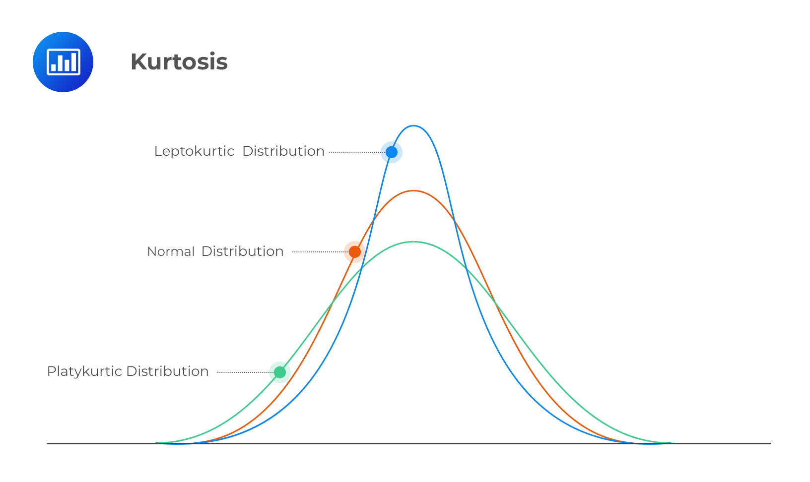
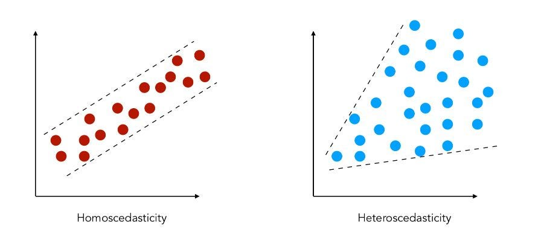

<!-- _class: centered -->

# Комплексный анализ данных (EDA)

### Exploratory Data Analysis - полный цикл


---


**Exploratory Data Analysis** - это процесс первичного изучения данных перед тем, как строить модели.

**Цель EDA:**
- Понять структуру данных
- Найти аномалии и выбросы
- Выявить зависимости между переменными
- Проверить предположения (assumptions)
- Сформулировать гипотезы


---

## Зачем нужен EDA?
**Без EDA:**
- Модель обучается на выбросах и мусоре
- Пропущенные данные не обработаны -> ошибки
- Нарушены предположения алгоритмов -> неверные результаты

**Классический пример - квартет Энскомба:**
Четыре датасета с одинаковыми: mean, std, корреляцией - но кардинально разными паттернами


---


```
1. Понимание данных
   └─ Что означает каждая переменная? Какой тип?

2. Описательная статистика
   └─ mean, median, std, skewness, kurtosis

3. Анализ пропущенных значений
   └─ Сколько? Паттерн? Случайные или нет?

4. Univariate analysis (одна переменная)
   └─ Распределение каждой переменной

5. Bivariate / Multivariate analysis
   └─ Зависимости между переменными

6. Выбросы
   └─ Обнаружение и принятие решения

7. Проверка статистических предположений
   └─ Нормальность, гомоскедастичность, линейность
```

---

<!-- _class: centered -->

## Блок 1
# Описательная статистика 

---

# Моменты распределения

**4 ключевых числа, описывающих распределение:**

| Момент | Что показывает | Метрика |
|--------|---------------|---------|
| 1-й | Центр | Mean |
| 2-й | Разброс | Variance / Std |
| 3-й | Асимметрия | **Skewness** |
| 4-й | "Пиковость" | **Kurtosis** |


---


$$\text{skewness} = \frac{E\left[(X-\mu)^3\right]}{\sigma^3}$$

- `skew ≈ 0` - симметричное распределение
- `skew > 0` - правый хвост длиннее (mean > median)
- `skew < 0` - левый хвост длиннее (mean < median)

**Практическое правило:**
- `|skew| < 0.5` - нормальное 
- `0.5 < |skew| < 1` - умеренная асимметрия 
- `|skew| > 1` - сильная асимметрия 

---

# Kurtosis (Эксцесс)

$$\text{kurtosis} = \frac{E\left[(X-\mu)^4\right]}{\sigma^4}$$

**Что показывает:** насколько "острый" пик у распределения и насколько тяжёлые хвосты.

**Базовое значение:** нормальное распределение имеет kurtosis = 3

**Excess kurtosis** (в pandas/scipy): `kurtosis - 3`

---

<div class="two-columns">

<div>

**Leptokurtic** (kurtosis > 0):
- Острый пик, тяжёлые хвосты
- Больше выбросов, чем ожидается
- Пример: финансовые доходности, цены

**Mesokurtic** (kurtosis = 0):
- Нормальное распределение

</div>

<div>

**Platykurtic** (kurtosis < 0):
- Плоский пик, лёгкие хвосты
- Меньше выбросов
- Пример: равномерное распределение

> Высокий kurtosis -> много выбросов  
> Низкий kurtosis -> данные "расплющены"

</div>
</div>

---


---


- skewness ≈ 1.88 -> сильный правый скос
- kurtosis ≈ 6.5 (excess ≈ 3.5) -> leptokurtic

- Большинство домов продаётся в диапазоне $100k–$250k
- Но есть "тяжёлый" правый хвост: дорогие дома $500k–$755k
- Больше экстремальных значений, чем при нормальном распределении

> **Важно для моделирования:** высокий kurtosis -> модель может плохо работать на выбросах

---


```python
import pandas as pd
from scipy import stats

col = df['SalePrice']

print(f"Mean:         {col.mean():,.0f}")
print(f"Median:       {col.median():,.0f}")
print(f"Std:          {col.std():,.0f}")
print(f"IQR:          {col.quantile(0.75) - col.quantile(0.25):,.0f}")
print(f"Skewness:     {col.skew():.4f}")
print(f"Kurtosis:     {col.kurt():.4f}")   # excess kurtosis
print(f"Min / Max:    {col.min():,} / {col.max():,}")
```

> `df.describe()` не показывает skewness и kurtosis - нужен `.skew()` и `.kurt()`

---

<!-- _class: centered -->

## Блок 2
# Анализ пропущенных значений

---

**MCAR - Missing Completely At Random:**
- Пропуск никак не связан с данными
- Пример: случайный технический сбой
- Безопасно: можно удалить или заполнить

**MAR - Missing At Random:**
- Пропуск зависит от другой переменной, но не от самого пропущенного значения
- Пример: мужчины реже заполняют поле "вес"
- Требует внимания при заполнении


---

**MNAR - Missing Not At Random:**
- Пропуск зависит от самого значения
- Пример: дорогие дома "скрывают" цену
- Опасно: может вносить систематическую ошибку

---


```python
total = df.isnull().sum().sort_values(ascending=False)
percent = total / len(df) * 100
missing = pd.DataFrame({'Total': total, 'Percent': percent})
missing = missing[missing['Total'] > 0]
```

**Стратегии обработки:**

| % пропусков | Действие |
|-------------|---------|
| > 40–50% | Удалить колонку |
| 5–40% | Заполнить (mean/median/mode/model) |
| < 5% | Удалить строки или заполнить |

> Правило 15% (Hair et al.) - > 15% пропусков -> удалять столбец

---

# Стратегии заполнения пропусков

**Числовые переменные:**
- `fillna(median)` - если данные скошены или есть выбросы
- `fillna(mean)` - если нормальное распределение
- Модель (KNN, regression imputation) - если сложная зависимость

---


**Категориальные переменные:**
- `fillna(mode)` - самое частое значение
- `fillna('Unknown')` - если пропуск = отдельная категория

**Особый случай - NaN как информация:**
- В house_prices: `PoolQC = NaN` означает "нет бассейна"
- Создаём отдельный признак: `HasPool = 0/1`

---

<!-- _class: centered -->

## Блок 3
# Univariate Analysis

---

# Univariate Analysis: числовые

**Что смотрим для каждой числовой переменной:**

1. Гистограмма + кривая нормального распределения
2. Boxplot (выбросы, Q1, Q3, IQR)
3. Skewness + Kurtosis
4. Q-Q plot (нормальность)


---

# Univariate Analysis: категориальные

**Что смотрим:**
1. Количество уникальных значений: `nunique()`
2. Частоты: `value_counts()`
3. Bar chart

- Есть ли редкие категории (< 1%)? -> объединить
- Есть ли дисбаланс классов? -> важно для модели
- Есть ли опечатки / дубликаты категорий?


---

<!-- _class: centered -->

## Блок 4
# Bivariate Analysis

---

# Bivariate Analysis: три варианта

| Тип пары | Инструмент |
|----------|-----------|
| Числовая и Числовая | Scatter plot, корреляция |
| Числовая и Категориальная | Boxplot, violin plot |
| Категориальная и Категориальная | Crosstab, heatmap, chi-squared |

---

# Числовая и Числовая


```python
df.plot.scatter(x='GrLivArea', y='SalePrice')
```

**Что искать:**
- Линейная или нелинейная зависимость?
- Выбросы, которые нарушают паттерн?
- Гомоскедастичность (равномерный разброс)?

**Корреляция:**
```python
r, p = stats.pearsonr(df['GrLivArea'], df['SalePrice'])
```

---

# Числовая и Категориальная

```python
sns.boxplot(x='OverallQual', y='SalePrice', data=df)
```

**Что искать:**
- Растут ли медианы с ростом категории?
- Есть ли перекрытие боксов? (слабая связь)
- Есть ли выбросы в отдельных категориях?

**Дополнительно:**
```python
df.groupby('OverallQual')['SalePrice'].agg(['mean', 'median', 'std'])
```

---

# Категориальная и Категориальная

**Crosstab + Chi-squared:**
```python
ct = pd.crosstab(df['CentralAir'], df['Neighborhood'])
chi2, p, dof, expected = stats.chi2_contingency(ct)
# p < 0.05 -> зависимость значима
```

**Визуализация:**
```python
ct_norm = pd.crosstab(df['CentralAir'], df['BldgType'], normalize='index')
ct_norm.plot(kind='bar', stacked=True)
```

---

<!-- _class: centered -->

## Блок 5
# Multivariate Analysis

---

# Correlation Matrix (Heatmap)


```python
corrmat = df.corr()
sns.heatmap(corrmat, vmax=0.8, square=True, cmap='coolwarm')
```

- Сильная корреляция с целевой переменной (>0.5)
- Мультиколлинеарность: пары признаков с r > 0.8
  - `GarageCars` и `GarageArea` - "братья-двойники"

> Мультиколлинеарность: дублирующая информация вредит линейным моделям

---

# Zoomed Correlation Heatmap

**Топ-N переменных, коррелирующих с целевой:**

```python
k = 10
cols = corrmat.nlargest(k, 'SalePrice')['SalePrice'].index
cm = np.corrcoef(df[cols].values.T)

sns.heatmap(cm, annot=True, fmt='.2f',
            yticklabels=cols, xticklabels=cols)
```

> Это позволяет сосредоточиться на действительно важных переменных

---

# Pairplot

**Scatter matrix - все пары важных переменных:**

```python
cols = ['SalePrice', 'OverallQual', 'GrLivArea',
        'GarageCars', 'TotalBsmtSF', 'FullBath', 'YearBuilt']
sns.pairplot(df[cols])
```

- Диагональ: распределение каждой переменной
- Выше/ниже диагонали: scatter plots всех пар
- Нелинейные зависимости
- Сгруппированные облака точек

---

<!-- _class: centered -->

## Блок 6
# Обнаружение выбросов

---

# Методы обнаружения выбросов

**Метод Z-score (стандартизация):**
```python
from sklearn.preprocessing import StandardScaler
z_scores = StandardScaler().fit_transform(df[['SalePrice']])
# |z| > 3 -> потенциальный выброс
outliers = df[np.abs(z_scores) > 3]
```

```python
Q1 = df['SalePrice'].quantile(0.25)
Q3 = df['SalePrice'].quantile(0.75)
IQR = Q3 - Q1
lower = Q1 - 1.5 * IQR
upper = Q3 + 1.5 * IQR
outliers = df[(df['SalePrice'] < lower) | (df['SalePrice'] > upper)]
```

---


**Univariate:** значение экстремально само по себе
- Дом за $755k: выброс? Или просто дорогой дом?

**Bivariate:** значение нарушает паттерн в паре переменных
```python
# Большая площадь + маленькая цена -> выброс
df.plot.scatter(x='GrLivArea', y='SalePrice')
```

> Дома с большой area и низкой ценой - ошибки

- Изучить контекст: ошибка данных или реальный случай?
- Если ошибка -> удалить
- Если реальный -> оставить, но помнить о них

---

<!-- _class: centered -->

## Блок 7
# Проверка статистических предположений

---


Перед применением большинства статистических и ML методов:

1. **Нормальность** - данные должны быть нормально распределены (или близко к этому)

2. **Гомоскедастичность**: Модель ошибается одинаково и на малых, и на больших значениях. 

3. **Линейность** - связь между переменными линейна

4. **Независимость ошибок** - ошибки не коррелируют друг с другом

---

# Нормальность: диагностика

**Гистограмма + fitted normal curve:**
```python
sns.histplot(df['SalePrice'], kde=True, stat='density')
x = np.linspace(df['SalePrice'].min(), df['SalePrice'].max(), 100)
plt.plot(x, stats.norm.pdf(x, df['SalePrice'].mean(), df['SalePrice'].std()))
```

**Q-Q plot:**
```python
stats.probplot(df['SalePrice'], plot=plt)
```

- `|skewness| > 1` -> проблема
- `|excess kurtosis| > 2` -> проблема

---


**Проблема:** SalePrice сильно скошен (skew ≈ 1.88)

**Лог-трансформация** для положительных скошенных данных:
```python
df['SalePrice_log'] = np.log(df['SalePrice'])
# После: skew ≈ 0.12 
```

| Проблема | Трансформация |
|----------|-------------|
| Правый скос (умеренный) | `sqrt(x)` |
| Правый скос (сильный) | `log(x)` |
| Правый скос (экстремальный) | `1/x` |
| Нули в данных | `log(x + 1)` |
| Двусторонний | Box-Cox |

---

# Гомоскедастичность

**Гомоскедастичность** - разброс зависимой переменной одинаков по всему диапазону независимой.

**Проверка:** scatter plot остатков


> Конусообразный scatter plot -> гетероскедастичность -> лог-трансформация часто помогает

---


---

# Почему лог-трансформация решает несколько проблем


 **Нормальность** - skewness падает с 1.88 до ~0.12  
 **Гомоскедастичность** - разброс становится равномерным  
 **Линейность** - нелинейная связь становится линейной  

**Интерпретация лог-трансформации:**
- Изменение на 1 единицу X -> изменение на X% в Y
- Модели часто интерпретируются как "на 1% больше площади -> на Y% дороже"

---

<!-- _class: centered -->

## Блок 8
# Полный цикл EDA на house_prices

---


```
1. Загрузка и первичный осмотр
   └─ shape, dtypes, head, describe

2. Целевая переменная (SalePrice)
   └─ describe, histogram, skewness, kurtosis, Q-Q plot

3. Предварительный анализ признаков
   └─ Ожидаемые важные переменные

4. Анализ пропущенных данных
   └─ Визуализация, решение по каждой группе

5. Выбросы
   └─ Z-score + bivariate scatter plots

6. Корреляции
   └─ Heatmap, zoomed heatmap, pairplot

7. Проверка предположений
   └─ Нормальность, лог-трансформация, гомоскедастичность
```

---

# EDA Чеклист

 Понята природа каждой переменной (тип, смысл)  
 Посчитаны описательные статистики (incl. skewness, kurtosis)  
 Пропущенные значения найдены и обработаны  
 Выбросы обнаружены и изучены  
 Проверены распределения (normality)  
 Проанализированы зависимости с целевой переменной  
 Найдена мультиколлинеарность  
 Применены трансформации при необходимости  
 Сформулированы выводы о важных признаках  

