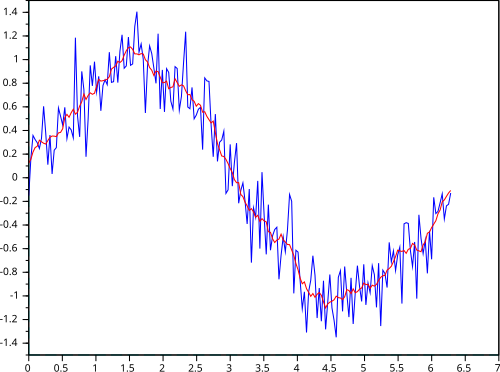

<!-- _class: centered -->

# Временные ряды

### Тренд, сезонность, шум, прогнозирование

---

# Почему это важно аналитикам

- Метрики почти всегда живут во времени: продажи, трафик, заявки, выручка
- Временной ряд помогает понять не только значение, но и динамику
- По ряду можно заметить сезонность, аномалии и эффект изменений


---

# Что мы будем делать

1. Разберем структуру временного ряда
2. Посмотрим на тренд, сезонность и шум
3. Сделаем rolling mean / rolling std
4. Попробуем простую декомпозицию
5. Научимся правильно делить данные по времени
6. Построим базовый прогноз и интерпретируем результат

---

# Что такое временной ряд

**Временной ряд** - это данные, упорядоченные по времени.

Примеры:
- дневные продажи
- недельный трафик сайта
- ежемесячная выручка
- число обращений в поддержку

**Ключевая особенность:** порядок наблюдений важен

---

# Типы временных рядов

1. **Regular intervals (metrics)**
- наблюдения через фиксированный шаг времени
- пример: дневные продажи, недельный трафик

2. **Irregular intervals (events)**
- события происходят нерегулярно
- пример: логи ошибок, инциденты, клики

**Важно:** под каждый тип нужны разные подходы к анализу

---

# Какие задачи решает Time Series Analysis

- **Forecasting**: прогноз будущих значений
- **Anomaly Detection**: поиск аномалий
- **Trend Analysis**: анализ долгосрочного движения
- **Seasonality Extraction**: выделение сезонных паттернов

---


Используем, если:
- есть стабильные исторические данные
- видны временные паттерны (тренд/сезонность)
- будущее зависит от прошлого

Не используем как основной подход, если:
- данные хаотичны и слишком шумные
- исторический паттерн не повторяется
- ключевые внешние факторы не наблюдаются в данных

---

# Из чего состоит ряд

Обычно в ряду видят 4 компонента:
- **Trend** - долгосрочное направление
- **Seasonality** - повторяющийся паттерн
- **Noise** - случайные колебания
- **Outliers** - аномальные точки

---

# Примеры компонентов

| Компонент | Как выглядит | Пример |
|-----------|--------------|--------|
| Trend | плавный рост / падение | рост пользователей |
| Seasonality | повторяется по циклу | спад по выходным |
| Noise | случайный разброс | ежедневные колебания |
| Outlier | резкий выброс | сбой трекинга |

---

# Как смотреть на ряд

Первый шаг - обычный график:
- по оси X - время
- по оси Y - метрика
- отмечаем резкие скачки и провалы
- смотрим, повторяются ли паттерны

**Интуиция:** если глаз видит структуру, модель потом тоже может ее использовать

---

# Скользящие метрики

**Rolling mean** сглаживает шум и показывает общий тренд.

**Rolling std** помогает увидеть, где ряд становится более нестабильным.

```python
df['sales_roll_mean_7'] = df['sales'].rolling(window=7).mean()
df['sales_roll_std_7'] = df['sales'].rolling(window=7).std()
```

---



---

# Зачем нужен rolling window

Rolling-метрики полезны, когда:
- ряд шумный
- важно увидеть локальный тренд
- нужно сравнить текущий уровень с недавней историей

**Важно:** окно выбирают по задаче:
- 7 дней для недельной динамики
- 30 дней для месячного сглаживания

---

# Декомпозиция ряда

Декомпозиция раскладывает ряд на части:
- trend
- seasonal
- residual

Это помогает понять, что в данных системное, а что случайное.

**Практический смысл:** легче объяснить поведение метрики и найти аномалии

---

# Stationarity простыми словами

**Stationarity**: когда среднее и разброс ряда примерно стабильны во времени.

Почему важно:
- многие классические модели (ARIMA/SARIMA) предполагают стационарность

---

Как проверить:
- визуально по графику
- тестом ADF (Augmented Dickey-Fuller)

Как улучшить:
- differencing
- логарифмирование
- удаление тренда/сезонности

---

# Предобработка ряда

Перед моделью обычно делаем:
- заполнение пропусков (interpolate/forward fill)
- обработку выбросов
- стабилизацию дисперсии (log/Box-Cox)
- приведение к регулярной частоте

**Идея:** плохая предобработка сильнее портит прогноз, чем выбор модели.

---

# Валидация данных

Перед любым прогнозом проверяем:
- регулярность частоты
- пропуски дат
- дубликаты дат
- выбросы и подозрительные скачки
- корректность периода наблюдения

**Правило:** временной ряд нельзя использовать без проверки оси времени

---

# Train / Test split по времени

Для временных рядов нельзя перемешивать строки случайно.

Правильный подход:
- train - прошлые периоды
- test - более поздние периоды

```python
train = df[df['date'] < '2025-01-01']
test = df[df['date'] >= '2025-01-01']
```

---

# Time-based cross-validation

Для временных рядов полезен rolling-window подход:
- тренируемся на более раннем окне
- валидируемся на следующем временном отрезке
- двигаем окно вперед

Это лучше имитирует реальный прогноз в проде.

---

# Почему нельзя shuffle

Если перемешать время, то:
- модель увидит будущее во время обучения
- метрика будет искусственно хорошей
- прогноз станет нереалистичным


---

# Базовые прогнозы

Перед сложными моделями всегда делаем baseline:
- **Naive forecast** - значение равно последнему наблюдению
- **Moving average** - среднее по окну
- **Seasonal naive** - значение равно тому же дню недели / месяцу

**Если baseline уже хороший, сложная модель может не дать большого прироста**

---


**ARIMA** = Autoregressive Integrated Moving Average.

Три части модели:
- **p** - autoregressive component, зависимость от прошлых значений
- **d** - differencing, чтобы убрать тренд и приблизить ряд к стационарности
- **q** - moving average component, зависимость от прошлых ошибок


---

# Лестница моделей

1. **Baseline**: naive, moving average, seasonal naive
2. **Classical**: ETS, ARIMA, SARIMA
3. **ML**: feature-based подход (например, XGBoost)
4. **Deep Learning**: LSTM и другие нейросети

Идем от простого к сложному, только если есть прирост качества

---

# Сколько данных нужно

- Для сезонных рядов желательно минимум 1-2 полных сезонных цикла
- Для ARIMA часто нужно хотя бы 50-100 наблюдений
- Для ML/DL обычно нужны сотни и тысячи точек

**Чем меньше данных, тем важнее простые и устойчивые baseline-модели.**

---

# Метрики качества прогноза

| Метрика | Что показывает |
|---------|----------------|
| MAE | средняя абсолютная ошибка |
| RMSE | сильнее штрафует большие ошибки |
| MAPE | относительная ошибка в процентах |

**Важно:** метрику выбирают под бизнес-задачу

---

# Ограничения Time Series

- **Non-stationarity**: меняется среднее/дисперсия
- **Concept drift**: паттерн меняется со временем
- **Seasonal drift**: сезонность не постоянна
- **Outliers и missing values** искажают модель
- **Переобучение**: сложная модель ловит шум

---

# Аномалии

Аномалии в ряду могут быть полезными:
- всплеск трафика из-за кампании
- падение выручки из-за сбоя
- выброс из-за ошибки в данных

**Вопрос аналитика:** это реальное событие или проблема в данных?

---


- есть ежедневные продажи за 2 года
- видим рост в целом
- заметен спад по выходным
- в декабре продажи выше обычного

Что делаем:
- проверяем trend
- проверяем weekly seasonality
- строим baseline forecast
- ищем аномальные дни


---

# Итог

| Задача | Инструмент |
|--------|-----------|
| Увидеть общую динамику | line plot, rolling mean |
| Найти сезонность | decomposition, сезонные паттерны |
| Проверить аномалии | график, residuals |
| Сделать прогноз | naive / moving average / seasonal naive |
| Оценить качество | MAE, RMSE, MAPE |

**Временные ряды помогают понимать не только что происходит, но и когда и почему это происходит.**