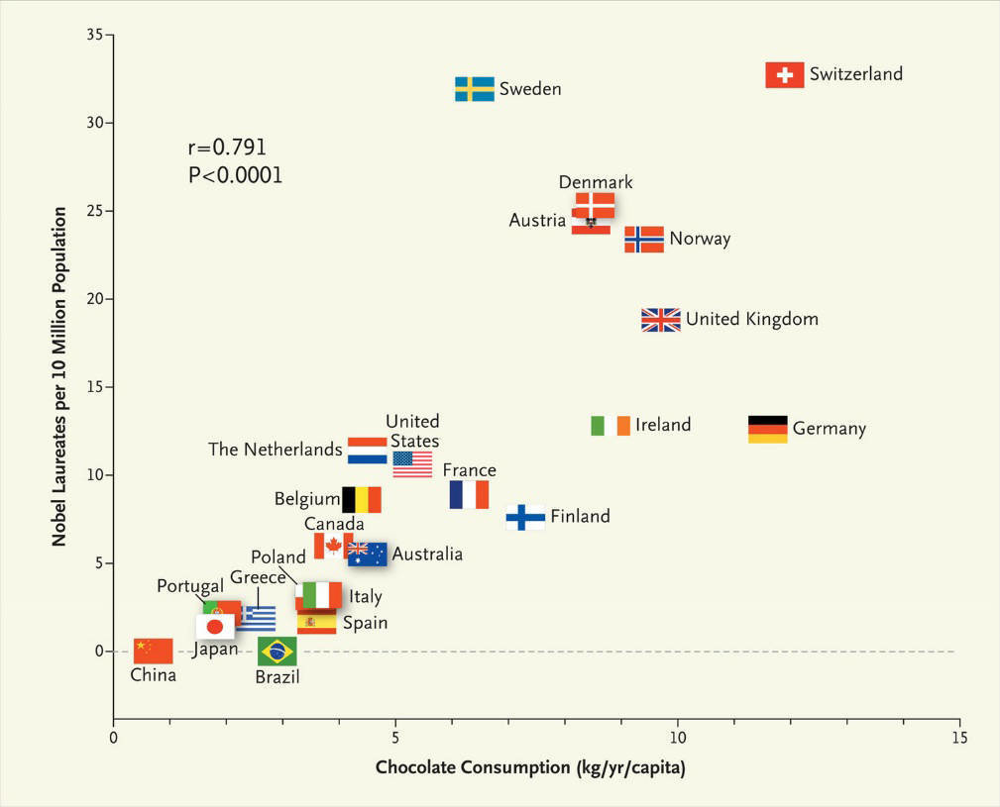

<!-- _class: centered -->
# Статистический анализ
---
**Статистический анализ** - это способ понять большие объёмы данных: найти закономерности, тренды и сделать выводы.
Это основной инструмент аналитика, который помогает отвечать на вопросы:
    **-** что происходит?
    **-** насколько сильно это происходит?
    **-** есть ли связь между признаками?
    **-** что можно предсказать?
    **Статистика** = фундамент анализа данных, визуализации и машинного обучения

---
# Типы статистики
 **Описательная статистика**, статистика, которая систематизирует и обобщает данные из выборки
    **Основная цель**: Описать основные характеристики данных в исследовании. Представляет данные в обобщенном и систематизированном виде.
    **Методы**: Использует показатели центральной тенденции (такие как среднее, медиана и мода) и изменчивости (такие как дисперсия и стандартное отклонение) для характеристики выборки или совокупности. 

---
# Инференционная статистика
 **Инференционная статистика = можно ли сделать выводы?** 
 Инференционная статистика делает еще один шаг вперед по сравнению с описательной статистикой, делая выводы на основе данных и давая рекомендации.
    **-** Можно ли обобщить выборку на всю популяцию?
    **-** Действительно ли связь существует, или это случайность?
    **-** Насколько надёжен наш вывод?

---
# Центральная тенденция
Центральная тенденция - это статистическая мера, которая описывает одно значение как представительное среднее или «типичное» значение набора данных.
**«Какое значение наиболее типично для этих данных?»**
Три основных показателя:
1) **Среднее (Mean)**
2) **Медиана (Median)**
3) **Мода (Mode)**
---

# Среднее, mean
**Cреднее арифметическое значение набора данных.**
**Как рассчитать**: сложит все значения и разделить их на количество значений
**Лучше всего подходит для**: наборов данных без крайних выбросов, так как среднее значение может быть искажено из-за них
**Выбросы в статистике** - это точки данных, которые значительно отличаются от других значений в наборе данных и находятся вдали от основной части данных.

---
# Медиана
**Медиана** - это среднее значение в наборе данных, при котором 50 % точек данных находятся выше него, а 50 % - ниже
**Как рассчитать**: Расположить данные в порядке возрастания и найди среднее число. Если количество данных четное, то среднее значение будет равно среднему из двух средних чисел
**Наилучшее применение**: наборы данных с выбросами, так как на него не влияют экстремальные значения. 

---
# Мода
Мода - это значение, которое чаще всего встречается в наборе данных.
**Как рассчитать**: подсчитать частоту каждого значения и найди то, которое встречается чаще всего
**Наилучшее применение**: категориальные данные или определение наиболее часто встречающегося значения.
**Набор данных** может иметь один модальный показатель, несколько модальных показателей или не иметь модального показателя вообще. 

---
# Примеры
- **Среднее(Mean)**:
    Оценки: 70, 80, 90
    Среднее = (70+80+90)/3 = 80.
- **Медиана**:
    Данные: 2, 3, 10, 100. 
    Медиана = (3+10)/2 = 6.5
- **Мода**:
Оценки: 5, 4, 4, 3, 4. 
    Мода = 4

---
# Как выбирать показатель
| Ситуация                                      | Какой показатель использовать |
| --------------------------------------------- | ----------------------------- |
| Данные без выбросов, нормальное распределение | **Среднее**                   |
| Есть выбросы (доходы, цена квартир, зарплаты) | **Медиана**                   |
| Категориальные признаки (город, тип дома)     | **Мода**                      |
| Аналитика рынка недвижимости                  | Медиана                       |
| Анализ продаж                                 | Среднее и медиана             |
| Анализ поведения пользователей                | Мода (частые действия)        |
---

# Изменчивость / Разброс данных
**Изменчивость, разброс и дисперсия (Variability, spread, dispersion)** - это синонимы, которые описывают, насколько точки данных удалены друг от друга и от центра распределения

**Также данная характеристика отвечает на вопросы:**
    **-** Есть ли стабильность в данных или они сильно "скачут"?
    **-** Можно ли доверять среднему?

---

# Основные показатели изменчивости
1) Размах (Range)
2) Дисперсия (Variance)
3) Стандартное отклонение (Standard deviation)
4) IQR – межквартильный размах

---
# Размах
Размах - это разница между наибольшим и наименьшим значениями в наборе данных, которая показывает диапазон разброса значений.
**Назначение**: Размах показывает, насколько широко разбросаны данные. Большой размах означает большой разброс, а маленький размах - значения расположены близко друг к другу.

---
# Дисперсия
**Дисперсия (variation) - это мера разброса (или вариации) данных относительно их среднего значения.**
Дисперсия показывает, насколько в среднем данные отклоняются от среднего.
**Высокая дисперсия** -> данные нестабильные
**Низкая дисперсия** -> данные близко друг к другу
$$
\text{Var}(X) = \frac{1}{n} \sum_{i=1}^{n} (x_i - \mu)^2
$$

---
# Стандартное отклонение
**Стандартное отклонение - это корень из дисперсии.**
Стандартное отклонение показывает, на сколько в среднем каждая точка отличается от среднего
**Маленькое std** -> данные стабильны
**Большое std** -> данные разбросаны

Имеет возможность интерпретировать дисперсию **"Понятным языком для человека"**

---
# IQR (межквартальный размах)
**Квартиль** - это точка, которая делит данные на 4 равные части
Чтобы рассчитать квартали, нужно:
1) Отсортировать данные по возрастанию
2) Разделить набор на 4 части
3) Каждая часть содержит 25% данных

---
Три **важных квартиля**
После сортировки данных мы определяем 3 границы:
1) Q1 (1 квартиль, медиана нижней половины) — точка, ниже которой 25% данных
2) Q2 (медиана) — точка, ниже которой 50% данных
3) Q3 (3 квартиль, медиана верхней половины) — точка, ниже которой 75% данных

---
**Межквартальный размах**
Показывает диапазон средних 50% данных.
Игнорирует выбросы и смотрит только на **основную массу** данных.
$$
\text{IQR (Interquartile Range)} = ( Q_3 - Q_1 )
$$
- Устойчив к выбросам
- Помогает выявлять выбросы
- Показывает плотность данных в центре
Если IQR маленький -> данные сосредоточены
Если IQR большой -> данные сильно разбросаны

---
**Примеры**
1) **Размах**. Данные:
5, 7, 9, 12, 20
Range = 20−5 = 15
**Данные разбросаны на диапазон 15 единиц.**
2) **Дисперсия** Данные:
10, 12, 13, 15
μ = 12.5 (среднее)
Отклонения от среднего:
10 - 12.5 = -2.5.... -> Квадраты отклонений 6.25
**Среднее отклонение значений в квадрате = 3.25.**

---
3) **Стандартное отклонение** 
В среднем, каждое значение отклоняется от среднего на
$$ Std = \sqrt{VAR} = \sqrt(3.25)​ ≈ 1.8 $$
4) **Квартали** Данные:
2, 3, 5, 8, 10, 12, 15, 18
Медиана Q2 = 9, Q1 = 4, Q3 = 13.5
IQR = 13.5 - 4 = 9.5
50% данных лежат на интервале шириной 9.5 единиц

---
5) **Поиск выбросов** с помощью IQR
- IQR помогает определить выбросы, так как показывает плотность «основных» данных
  1) Найти IQR = Q3 - Q1
  2) Найти границы:
    - Нижняя граница = Q1 - 1.5 * IQR
    - Верхняя граница = Q3 + 1.5 * IQR
  3) Все значения ниже или выше границ - выбросы

---
# Пример поиска выбросов
**Данные**:
4, 5, 6, 7, 8, 9, 10, 30
Q1 = 5.5
Q3 = 9.5
IQR = 9.5 − 5.5 = 4
**Границы**:
Нижняя = 5.5 − 1.5×4 = −0.5
Верхняя = 9.5 + 1.5×4 = 15.5
**Интервал [-0,5; 15.5]** => Выброс = 30

---
# Ковариация
**Ковариация** - это показатель, который показывает, **как два признака меняются вместе**.
Она отвечает на вопросы:
- Увеличиваются ли признаки вместе?
- Если один растёт, уменьшается ли другой?
- **cov > 0** — признаки растут вместе  
- **cov < 0** — один растёт, другой уменьшается  
- **cov ≈ 0** — линейной связи почти нет  

---
# Корреляция

**Корреляция** - это нормированная ковариация, показывающая  
**силу и направление линейной связи между двумя признаками.**
Диапазон: **от −1 до +1**
- Не зависит от масштаба (рост в см или рост в м даст одинаковую корреляцию)
- Удобна для сравнения разных признаков

---
# Коэффициент корреляции Пирсона
Корреляция Пирсона измеряет линейную связь между признаками.
**ρ≈1** - сильная положительная связь
(одна величина растёт -> вторая величина растёт)
**ρ≈−1** - сильная отрицательная связь
(одна величина растёт -> вторая величина убывает)
**ρ≈0** - линейной связи почти нет

---
# Примеры
1) Площадь квартиры и цена
  - Чем больше площадь, тем дороже цена: ρ>0
2) Возраст автомобиля и его цена
  - Чем старше машина, тем она дешевле: ρ<0
3) Рост человека и номер его квартиры
  - Связи нет: ρ≈0.

---

  

  

    Корреляция ≠ причинность    
    Может быть случайность, скрытая переменная или обратная связь.
  

---

# Типы данных в аналитике

Перед любым анализом данных важно понять, какого типа признак, поскольку:

- от этого зависит выбор статистических методов,

- какие графики можно строить,

- какие ML-модели применять,

- как кодировать данные (label/one-hot/ordinal)

---
# В аналитике существует 4 ключевых типа признаков:

1) Количественные (Numerical)

2) Категориальные (Categorical)

3) Порядковые (Ordinal)

4) Бинарные (Binary)

---

# Количественные данные 
Это данные, которые можно измерить и над которыми можно выполнять арифметические операции.
- Непрерывные - могут принимать бесконечное количество значений
пример: рост, цена, площадь, время, вес
- Дискретные - целые значения
пример: количество комнат, возраст в годах, количество покупок

---
# Категориальные данные
Это данные, которые выражаются в виде групп/классов, не имеют числового смысла.
**Примеры**:
- город,
- тип материала дома (кирпич/монолит/панель),
- марка автомобиля,
- профессия.

---
# Порядковые данные 
Категориальные признаки, имеющие порядок, но не имеющие точного числового расстояния между уровнями.
**Примеры**:
- уровень образования (среднее → бакалавр → магистр → PhD),
- качество жилья (низкое → среднее → высокое),
- этажность (низкий/средний/высокий),
- состояние товара (плохое → нормальное → новое).

---
# Бинарные данные 
Это признаки, которые принимают только 2 значения.
**Примеры**:
- да / нет,
- 0 / 1,
- купил / не купил,
- мужчина / женщина,
- наличие лифта: есть / нет.

---
# Квартиры из krisha.kz
| Признак       | Тип данных  | Почему                     |
| ------------- | ----------- | -------------------------- |
| price         | Numerical   | Цена - число               |
| area          | Numerical   | Метры                      |
| rooms         | Discrete    | Целое количество           |
| district      | Categorical | Район нет числового смысла |
| building_type | Categorical | Панель/кирпич/монолит      |
| floor         | Ordinal     | Этаж - имеет порядок       |
| built_year    | Numerical   | Год постройки              |
| condition     | Ordinal     | старое -> среднее -> новое   |