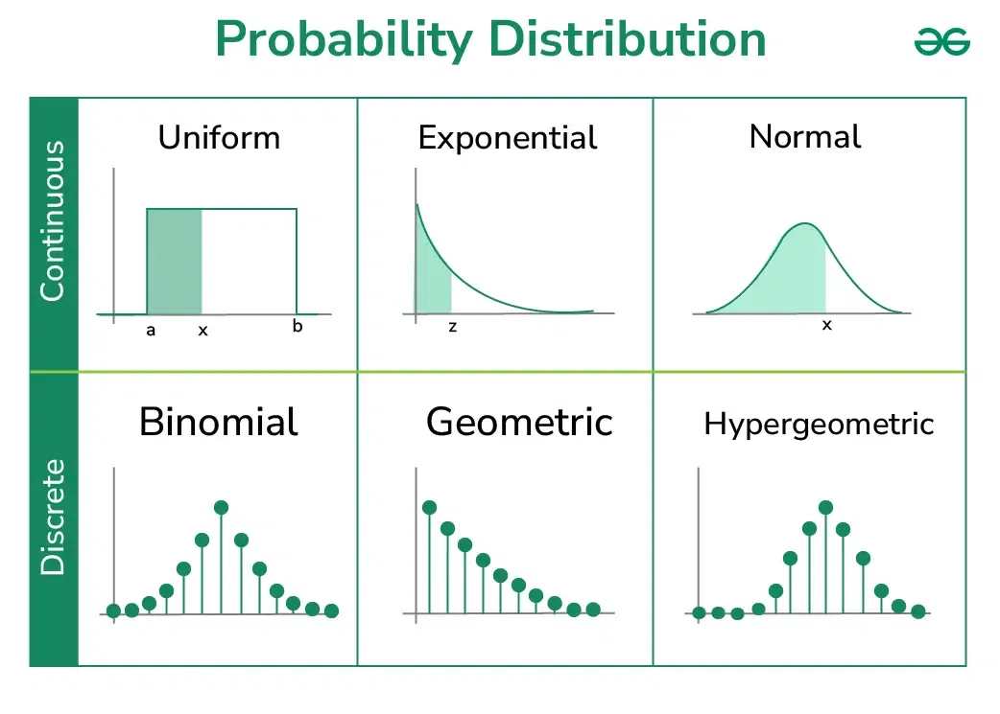
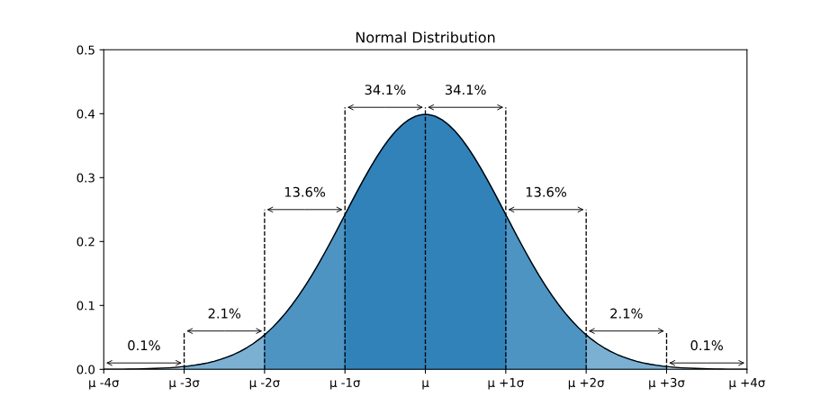
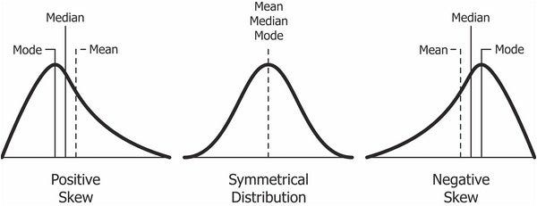

<!-- _class: centered -->
# Визуализация данных

---
**Распределение данных** показывает нам все возможные значения данных и то, *как часто* они встречаются.
  - определяет, какие статистики работают лучше 
  - показывает наличие выбросов
  - помогает понять структуру данных
  - влияет на выбор моделей
  - объясняет форму данных

---
**Распределение вероятностей** - это про математическую модель того, как данные ведут себя в среднем
Это функция, которая описывает, как распределяются значения случайной величины.
- Оно указывает вероятность того, что случайная величина примет определенные значения или будет находиться в определенном диапазоне

---
# Типы распределения вероятностей
1) **Дискретные**
Значения - отдельные точки:
- число детей в семье
- количество комнат
- число покупок
**-** Используют **PMF (Probability Mass Function)**, которая отвечает на вопрос: “Какова вероятность каждого конкретного значения?”

---

2) **Непрерывные**
Значений бесконечно много:
- рост
- вес
- время
- цена
Используют **PDF (Probability Density Function)** Она не даёт вероятность точки (так как их бесконечно), но говорит, где значения сконцентрированы плотнее.

---
<!-- _class: centered -->

---

# Гистограмма
Главный график для анализа распределения - это *Гистограмма*.

* **Ось X (Горизонтальная):** Значение переменной (например, Рост, Цена, Оценка).
* **Ось Y (Вертикальная):** Частота (Сколько раз это значение встретилось?).

---

# Нормальное распределение 
##### 1. Характеристики 
* Форма колокола.
* Полная симметрия.
* Mean = Median = Mode. Все они находятся в одной точке (на вершине).
* **Примеры:** Рост людей, вес, IQ, размер обуви.
---

# Эмпирическое правило (68-95-99.7)
Если данные распределены нормально, мы можем предсказывать будущее.
* *68%* данных лежат в пределах *1 стандартного отклонения* ($\sigma$) от среднего.
* *95%* данных лежат в пределах *2 стандартных отклонений* ($2\sigma$).
* *99.7%* данных лежат в пределах *3 стандартных отклонений* ($3\sigma$).

---

---

## Скошенные распределения (Skewness)

---

## Зачем это нужно?
 **Поиск аномалий (Выбросов/outliers):**
    В банковском деле транзакция, которая отклоняется на $3\sigma$ от вашей обычной траты, помечается как «Мошенничество» и блокируется.
 **Управление рисками:**
    Зная распределение, можно рассчитать «Value at Risk» (сколько денег мы можем потерять с вероятностью 95%).

